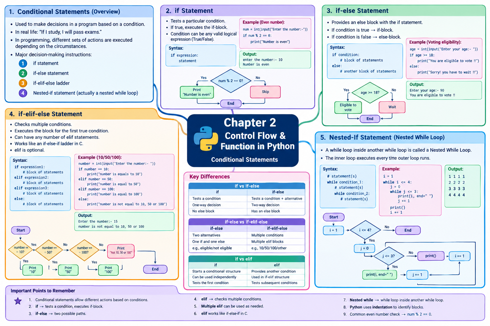

# LJ-Python-sem3-chapter2-explained
# 🐍 Python Programming — Chapter 2

## Control Flow & Function in Python

I’ll follow the PPT **in its exact order** and use it as the primary source. This chapter’s uploaded PPT covers **Conditional Statements**, including `if`, `if-else`, `if-elif-else`, and the section titled **Nested-If statement**, whose actual example/syntax describes a nested `while` loop.

# STEP 1 — DEEP EXPLANATION

---

# 1. Conditional Statements

## 1.1 What is a Conditional Statement?

In programming, sometimes we do not want every statement to execute every time.

We want the program to **make a decision based on a condition**.

The PPT gives a real-life example:

> If I study, I will pass exams.

Here, the action depends on a condition:

```text
Condition
   │
   ▼
I study?
   │
 ┌─┴─┐
Yes  No
 │    │
 ▼    ▼
Pass  Condition not satisfied
exam
```

Similarly, Python programs can perform different sets of actions depending on circumstances.

### Simple definition

**Conditional statements** are statements used to make decisions in a program based on whether a condition is true or false.

---

## 1.2 Major Decision-Making Instructions

The PPT identifies these decision-making instructions:

1. **if statement**
    
2. **if-else statement**
    
3. **if-elif-else ladder**
    
4. **Nested-if statement**
    

We will study each one in the same order.

---

# 2. `if` Statement

## 2.1 Definition

The `if` statement is used to **test a particular condition**.

If the condition is **true**, the block of code associated with the `if` statement is executed.

This block is called the **if-block**.

### Important point

The condition of an `if` statement can be any valid **logical expression** that evaluates to either:

- `True`
    
- `False`
    

---

## 2.2 Working of `if`

The basic working is:

```text
          Condition
              │
         ┌────┴────┐
       True       False
         │           │
         ▼           ▼
   Execute if-block  Skip it
```

So:

```python
if condition:
    statement
```

The statement inside the `if` block executes **only when the condition is true**.

---

## 2.3 Syntax of `if`

The PPT gives the syntax as:

```python
if expression:
    statement
```

### Explanation

|Part|Meaning|
|---|---|
|`if`|Python keyword used for decision-making|
|`expression`|Condition to be tested|
|`:`|Indicates the beginning of the block|
|`statement`|Code executed when condition is true|

### Exam Point ⭐

Python uses **indentation** to identify the statements belonging to the `if` block.

Example:

```python
if age >= 18:
    print("Eligible")
```

The `print()` statement is part of the `if` block because it is indented.

---

# 2.4 Example — Checking Even Number

The PPT provides this example:

```python
num = int(input("enter the number:-"))

if num % 2 == 0:
    print("Number is even")
```

### Understanding the program

Suppose the user enters:

```text
10
```

The condition becomes:

```python
10 % 2 == 0
```

The `%` operator gives the remainder.

```text
10 ÷ 2
remainder = 0
```

Therefore:

```python
10 % 2 == 0
```

is `True`.

So Python executes:

```python
print("Number is even")
```

### Output

```text
enter the number:- 10
Number is even
```

This output is shown in the PPT.

### Flowchart

```text
       Start
         │
         ▼
   Enter number
         │
         ▼
   num % 2 == 0?
      /       \
    Yes        No
     │          │
     ▼          ▼
"Number is    Nothing
  even"
     │
     ▼
    End
```

### ⭐ Exam Point

Remember:

```python
num % 2 == 0
```

is commonly used to check whether a number is **even**.

---

# 3. `if-else` Statement

## 3.1 Definition

The `if-else` statement provides an **else block** along with the `if` statement.

The `else` block is executed when the condition of the `if` statement is **false**.

Therefore, there are two possible paths:

```text
             Condition
                 │
           ┌─────┴─────┐
         True         False
           │             │
           ▼             ▼
       if-block      else-block
           │             │
           └─────┬───────┘
                 ▼
                End
```

### Simple definition

**`if-else` is used when a program needs to choose between two alternatives.**

---

# 3.2 Working of `if-else`

If the condition is:

```text
True
```

Python executes the **if-block**.

If the condition is:

```text
False
```

Python executes the **else-block**.

The PPT explicitly describes this two-way behavior.

---

# 3.3 Syntax of `if-else`

The PPT gives the structure as:

```python
if condition:
    # block of statements
else:
    # another block of statements (else-block)
```

### Important syntax rules

- `if` is followed by a condition.
    
- The condition is followed by `:`.
    
- The `if` block must be indented.
    
- `else` is followed by `:`.
    
- The `else` block must also be indented.
    

---

# 3.4 Example — Voting Eligibility

The PPT provides a program to check whether a person is eligible to vote.

```python
age = int(input("Enter your age:- "))

if age >= 18:
    print("You are eligible to vote !!")
else:
    print("Sorry! you have to wait !!")
```

### How it works

Suppose:

```text
age = 90
```

The condition becomes:

```python
90 >= 18
```

This is `True`.

Therefore:

```python
print("You are eligible to vote !!")
```

is executed.

### Output shown in the PPT

```text
Enter your age:- 90
You are eligible to vote !!
```

### Flowchart

```text
             Start
               │
               ▼
          Enter age
               │
               ▼
          age >= 18?
          /        \
       Yes          No
        │            │
        ▼            ▼
  Eligible to      Wait
     vote           │
        │            │
        └─────┬──────┘
              ▼
             End
```

### ⭐ Exam Point

`if-else` is appropriate when there are **two possible alternatives**.

---

# 4. `if-elif-else` Statement

## 4.1 Why do we need `elif`?

Suppose we have **more than two conditions**.

For example, we might want to check:

```text
Is number 10?
Is number 50?
Is number 100?
Something else?
```

Using multiple independent `if` statements would not represent the same type of decision structure efficiently.

Python provides the **`elif`** statement.

---

## 4.2 Definition

According to the PPT, the `elif` statement enables us to **check multiple conditions** and execute the specific block of statements depending upon the true condition among them.

We can have **any number of `elif` statements** depending upon our requirement.

Using `elif` is optional.

### Simple definition

**`if-elif-else` is used to check multiple conditions one after another and execute the appropriate block.**

---

# 4.3 Relation to C

The PPT states that `elif` works like an **if-else-if ladder statement in C**.

Conceptually:

```text
Python                  C
------                  -
if                      if
elif                    else if
else                    else
```

### ⭐ Important

In Python, the keyword is:

```python
elif
```

not:

```python
else if
```

---

# 4.4 Syntax of `if-elif-else`

The PPT gives the following structure:

```python
if expression1:
    # block of statements

elif expression2:
    # block of statements

elif expression3:
    # block of statements

else:
    # block of statements
```

There can be multiple `elif` blocks.

---

# 4.5 Working of `if-elif-else`

The basic flow is:

```text
             Start
               │
               ▼
         Check condition 1
          /          \
       True          False
        │              │
        ▼              ▼
   Execute block   Check condition 2
                       /       \
                    True       False
                     │           │
                     ▼           ▼
                Execute      Check next
                              condition
                                 │
                              ...
                                 │
                              False
                                 │
                                 ▼
                            else-block
```

Python checks the conditions in sequence.

When the appropriate condition is true, its corresponding block is executed.

---

# 4.6 Example from PPT

The PPT provides:

```python
number = int(input("Enter the number:- "))

if number == 10:
    print("number is equals to 10")

elif number == 50:
    print("number is equal to 50")

elif number == 100:
    print("number is equal to 100")

else:
    print("number is not equal to 10, 50 or 100")
```

Suppose the user enters:

```text
15
```

Python checks:

```python
15 == 10
```

False.

Then:

```python
15 == 50
```

False.

Then:

```python
15 == 100
```

False.

Therefore, the `else` block executes.

### Output

```text
Enter the number:- 15
number is not equal to 10, 50 or 100
```

---

# 5. Nested-If Statement

## Important PPT Observation ⚠️

The PPT section is titled **“Nested-If statement”**, but the syntax and example shown on the slides actually describe a **nested `while` loop**: a `while` loop placed inside another `while` loop.

I will preserve the PPT's terminology while explaining exactly what its content shows.

---

# 5.1 Nested `while` Loop

The PPT explains that a `while` loop body can contain statements, and a `while` loop can be written inside another `while` loop.

A `while` loop inside another `while` loop is called a **Nested While Loop**.

### Simple definition

**A nested while loop is a `while` loop placed inside another `while` loop.**

---

# 5.2 Structure of Nested `while`

The PPT gives:

```python
# statement(s)

while condition_1:
    # statement(s)

    while condition_2:
        # statement(s)
```

The structure can be visualized as:

```text
Outer while loop
│
├── Outer condition
│
└── If True
     │
     ├── Outer statements
     │
     └── Inner while loop
          │
          ├── Inner condition
          │
          └── Inner statements
```

---

# 5.3 Understanding the Outer and Inner Loops

Consider:

```python
while condition_1:
    while condition_2:
        statement
```

There are two loops:

### Outer loop

```python
while condition_1:
```

### Inner loop

```python
while condition_2:
```

The inner loop is located inside the body of the outer loop.

Therefore, every time the outer loop executes, the inner loop gets a chance to execute.

---

# 5.4 Example from PPT

The PPT gives this program:

```python
i = 1

while i <= 4:
    j = 0

    while j <= 3:
        print(i, end=" ")
        j += 1

    print()
    i += 1
```

Let's understand it carefully.

---

## Step 1 — Initial value

```python
i = 1
```

So:

```text
i = 1
```

---

## Step 2 — Check outer condition

```python
while i <= 4:
```

Initially:

```text
1 <= 4
```

which is true.

So the outer loop begins.

---

## Step 3 — Set `j`

Inside the outer loop:

```python
j = 0
```

---

## Step 4 — Check inner condition

```python
while j <= 3:
```

Initially:

```text
0 <= 3
```

True.

So:

```python
print(i, end=" ")
```

prints the value of `i`.

Then:

```python
j += 1
```

increases `j` by 1.

---

## Step 5 — Inner loop repetitions

For `i = 1`:

```text
j = 0 → print 1
j = 1 → print 1
j = 2 → print 1
j = 3 → print 1
```

Then:

```text
j = 4
```

and:

```python
4 <= 3
```

is false.

So the inner loop stops.

Then:

```python
print()
```

moves to the next line.

---

## Step 6 — Increase `i`

The program executes:

```python
i += 1
```

So:

```text
i = 2
```

The outer loop starts another iteration.

The same process repeats.

---

# 5.5 Output

The PPT gives the following output:

```text
1 1 1 1
2 2 2 2
3 3 3 3
4 4 4 4
```

### Why this output occurs

The outer loop controls the value of `i`:

```text
1
2
3
4
```

The inner loop runs **four times for each value of `i`**.

Therefore:

```text
i = 1 → 1 1 1 1
i = 2 → 2 2 2 2
i = 3 → 3 3 3 3
i = 4 → 4 4 4 4
```

---

# 5.6 Nested Loop Execution Diagram

```text
i = 1
 │
 └── j = 0 → print 1
     j = 1 → print 1
     j = 2 → print 1
     j = 3 → print 1
     j = 4 → stop inner loop
 │
 ▼
i = 2
 │
 └── j = 0 → print 2
     j = 1 → print 2
     j = 2 → print 2
     j = 3 → print 2
     j = 4 → stop inner loop
 │
 ▼
i = 3
 │
 └── j = 0 → print 3
     j = 1 → print 3
     j = 2 → print 3
     j = 3 → print 3
 │
 ▼
i = 4
 │
 └── j = 0 → print 4
     j = 1 → print 4
     j = 2 → print 4
     j = 3 → print 4
 │
 ▼
i = 5
 │
 └── i <= 4 is False
             │
             ▼
            END
```

---

# 🔥 IMPORTANT DIFFERENCES

## `if` vs `if-else`

|`if`|`if-else`|
|---|---|
|Tests a condition|Tests a condition and provides an alternative|
|Executes code when condition is true|Executes one of two blocks|
|No `else` block is required|Contains an `else` block|
|Used for one-way decision|Used for two-way decision|

---

## `if-else` vs `if-elif-else`

|`if-else`|`if-elif-else`|
|---|---|
|Mainly handles two alternatives|Handles multiple conditions|
|Has one `if` and one `else`|Can contain multiple `elif` blocks|
|Suitable for two-way decisions|Suitable for multi-condition decisions|
|Example: eligible/not eligible|Example: 10/50/100/other|

---

## `if` vs `elif`

|`if`|`elif`|
|---|---|
|Starts a conditional structure|Provides another condition after `if`|
|Can be used independently|Used as part of an `if`-`elif` structure|
|Tests the first condition|Tests subsequent conditions|

The PPT specifically notes that `elif` can be used multiple times depending on the requirement.

---

# 📌 IMPORTANT EXAM POINTS

### ⭐ 1. Conditional statements

Conditional statements allow Python programs to perform different actions depending on conditions.

### ⭐ 2. `if`

Used to test a particular condition and execute the `if` block when the condition is true.

### ⭐ 3. `if-else`

Provides two possible execution paths:

```text
True  → if-block
False → else-block
```

### ⭐ 4. `elif`

Used to check multiple conditions.

### ⭐ 5. Multiple `elif`

Any number of `elif` statements can be used according to the requirement.

### ⭐ 6. `elif` and C

Python's `elif` works like an `if-else-if` ladder in C.

### ⭐ 7. Nested `while`

A `while` loop inside another `while` loop is called a **Nested While Loop** according to the PPT.

### ⭐ 8. Indentation

Python uses indentation to identify blocks of code.

---

# 📚 CHAPTER SUMMARY

The uploaded Chapter 2 PPT section covered **Conditional Statements** and four major decision/control structures:

```text
Conditional Statements
│
├── if statement
│   ├── Condition
│   ├── if-block
│   └── Example: even number
│
├── if-else statement
│   ├── if-block
│   ├── else-block
│   └── Example: voting eligibility
│
├── if-elif-else statement
│   ├── Multiple conditions
│   ├── Multiple elif statements
│   ├── else block
│   └── Example: number = 10/50/100/other
│
└── Nested-If section
    └── Nested while loop
        ├── Outer while
        ├── Inner while
        └── Example: repeated number pattern
```

This structure follows the topics actually present in the PPT.

---

# 📝 IMPORTANT DEFINITIONS

1. **Conditional Statement:** A statement used to perform different actions depending on conditions.
    
2. **`if` Statement:** A statement used to test a condition and execute an `if` block when the condition is true.
    
3. **`if-else` Statement:** A decision statement in which the `if` block executes when the condition is true and the `else` block executes when it is false.
    
4. **`elif`:** A Python statement used to check additional conditions in a conditional structure.
    
5. **Nested While Loop:** A `while` loop written inside another `while` loop.
    

---

# 🎯 PPT COVERAGE FOR STEP 1

|PPT Topic|Deeply Explained|
|---|--:|
|Conditional Statements|✅|
|Decision-making instructions|✅|
|`if` statement|✅|
|`if` syntax|✅|
|Logical expression|✅|
|Even-number example|✅|
|`if-else` statement|✅|
|`if-else` syntax|✅|
|Voting eligibility example|✅|
|`if-elif-else`|✅|
|Multiple conditions|✅|
|Multiple `elif`|✅|
|`elif` and C comparison|✅|
|`if-elif-else` syntax|✅|
|Number 10/50/100 example|✅|
|Nested-If section|✅|
|Nested `while` loop content|✅|
|Nested `while` syntax|✅|
|Nested `while` example|✅|
|Nested-loop output|✅|

**STEP 1 — Deep Explanation: COMPLETED ✅**

When you say **“next”**, I’ll continue with **STEP 2 — the complete chapter mind map**, without restarting or repeating this section.


<p align="center">
  
</p>

# STEP 2 — COMPLETE MIND MAP

```text
CHAPTER 2 — CONTROL FLOW & FUNCTION IN PYTHON
│
└── CONDITIONAL STATEMENTS
    │
    ├── 1. Overview
    │   ├── Decision-making based on conditions
    │   ├── Real-life example
    │   │   └── If I study → I will pass exams
    │   │
    │   └── Major decision-making instructions
    │       ├── if statement
    │       ├── if-else statement
    │       ├── if-elif-else ladder
    │       └── Nested-if statement
    │
    ├── 2. if Statement
    │   ├── Tests a particular condition
    │   ├── True → execute if-block
    │   ├── False → skip if-block
    │   ├── Condition
    │   │   └── Valid logical expression
    │   │       ├── True
    │   │       └── False
    │   ├── Syntax
    │   │   └── if expression:
    │   │       └── statement
    │   └── Example
    │       └── Check whether number is even
    │           ├── num = int(input(...))
    │           ├── num % 2 == 0
    │           └── Print "Number is even"
    │
    ├── 3. if-else Statement
    │   ├── Contains if-block and else-block
    │   ├── Condition True
    │   │   └── Execute if-block
    │   ├── Condition False
    │   │   └── Execute else-block
    │   ├── Syntax
    │   │   ├── if condition:
    │   │   │   └── block of statements
    │   │   └── else:
    │   │       └── another block of statements
    │   └── Example
    │       └── Voting eligibility
    │           ├── age >= 18
    │           │   └── Eligible to vote
    │           └── age < 18
    │               └── Have to wait
    │
    ├── 4. if-elif-else Statement
    │   ├── Checks multiple conditions
    │   ├── Executes block for true condition
    │   ├── Any number of elif statements
    │   ├── elif is optional
    │   ├── Similar to if-else-if ladder in C
    │   ├── Syntax
    │   │   ├── if expression 1:
    │   │   ├── elif expression 2:
    │   │   ├── elif expression 3:
    │   │   └── else:
    │   └── Example
    │       ├── number == 10
    │       ├── number == 50
    │       ├── number == 100
    │       └── Otherwise
    │           └── Not equal to 10, 50 or 100
    │
    └── 5. Nested-if Section
        │
        └── Nested While Loop
            ├── while loop inside another while loop
            ├── Outer while loop
            │   └── condition_1
            ├── Inner while loop
            │   └── condition_2
            ├── Syntax
            │   ├── while condition_1:
            │   │   └── statements
            │   │       └── while condition_2:
            │   │           └── statements
            │   └── Example
            │       ├── i = 1
            │       ├── while i <= 4
            │       ├── j = 0
            │       ├── while j <= 3
            │       ├── print(i, end=" ")
            │       ├── j += 1
            │       ├── print()
            │       └── i += 1
            │
            └── Output
                ├── 1 1 1 1
                ├── 2 2 2 2
                ├── 3 3 3 3
                └── 4 4 4 4
```

The mind map covers the complete set of topics and examples shown in the uploaded PPT.

# STEP 3 — MIND MAP IMAGE

The complete visual revision mind map has been created above, including the conditional-statement hierarchy, syntaxes, examples, outputs, decision flows, nested loop, and key differences.

**STEP 2 — Complete Mind Map: ✅ COMPLETED**

**STEP 3 — Mind Map Image: ✅ COMPLETED**

When you say **“next”**, I’ll begin **STEP 4 — MCQs FIRST**, with answers immediately after every question and comprehensive coverage of the PPT.

# STEP 4 — MCQs + ANSWERS

Now starting the **complete MCQ section**. I’ll cover every topic, syntax, example, output, comparison, and important point supported by the PPT. Answers are given immediately after each question, as requested.

---

## 🟢 A. Conditional Statements — Basic Concepts

### Q1. What is the main purpose of conditional statements in Python?

A) To store data  
B) To make decisions based on conditions  
C) To define functions  
D) To display images

**Answer: B) To make decisions based on conditions**

---

### Q2. Which of the following is a real-life example of a condition given in the PPT?

A) If it rains, I will use a computer  
B) If I study, I will pass exams  
C) If I sleep, I will eat  
D) If I run, I will study

**Answer: B) If I study, I will pass exams**

---

### Q3. According to the PPT, how many major decision-making instructions are listed?

A) 2  
B) 3  
C) 4  
D) 5

**Answer: C) 4**

---

### Q4. Which of the following is NOT listed as a major decision-making instruction in the PPT?

A) `if`  
B) `if-else`  
C) `if-elif-else`  
D) `switch-case`

**Answer: D) `switch-case`**

---

### Q5. Which statement is used to test a particular condition?

A) `if`  
B) `print`  
C) `input`  
D) `while`

**Answer: A) `if`**

---

### Q6. What happens when the condition of an `if` statement is true?

A) The program terminates  
B) The if-block is executed  
C) The else-block is executed  
D) The condition is ignored

**Answer: B) The if-block is executed**

---

### Q7. The block of code executed by an `if` statement when its condition is true is called:

A) Else-block  
B) Loop-block  
C) If-block  
D) Input-block

**Answer: C) If-block**

---

### Q8. The condition of an `if` statement can be:

A) Only an integer  
B) Only a string  
C) Any valid logical expression  
D) Only a Boolean variable

**Answer: C) Any valid logical expression**

---

### Q9. A logical expression can evaluate to:

A) Only 0  
B) Only 1  
C) True or False  
D) String or integer

**Answer: C) True or False**

---

# 🟢 B. `if` Statement

### Q10. Which keyword is used for a basic conditional statement in Python?

A) `when`  
B) `if`  
C) `condition`  
D) `check`

**Answer: B) `if`**

---

### Q11. Which of the following is the correct syntax of an `if` statement?

A)

```python
if expression
    statement
```

B)

```python
if expression:
    statement
```

C)

```python
if: expression
    statement
```

D)

```python
if(expression);
    statement
```

**Answer: B)**

```python
if expression:
    statement
```

---

### Q12. What symbol is used after the condition in an `if` statement?

A) `;`  
B) `,`  
C) `:`  
D) `.`

**Answer: C) `:`**

---

### Q13. In the following code, what does `%` represent in the expression?

```python
num % 2 == 0
```

A) Multiplication  
B) Division  
C) Remainder operation  
D) Exponentiation

**Answer: C) Remainder operation**

---

### Q14. What does the following condition check?

```python
num % 2 == 0
```

A) Whether the number is odd  
B) Whether the number is negative  
C) Whether the number is even  
D) Whether the number is zero

**Answer: C) Whether the number is even**

---

### Q15. What will be printed if the user enters `10`?

```python
num = int(input("enter the number:-"))

if num % 2 == 0:
    print("Number is even")
```

A) Number is odd  
B) Number is even  
C) 10  
D) No output

**Answer: B) Number is even**

---

### Q16. In the example from the PPT, what value is entered by the user?

A) 5  
B) 10  
C) 15  
D) 20

**Answer: B) 10**

---

### Q17. What is the purpose of `int()` in the example?

```python
num = int(input("enter the number:-"))
```

A) Converts the input into an integer  
B) Converts the input into a string  
C) Prints the input  
D) Checks whether input is even

**Answer: A) Converts the input into an integer**

---

### Q18. If the condition of an `if` statement is false and there is no `else`, what happens to the if-block?

A) It is executed anyway  
B) It is skipped  
C) It is repeated  
D) It causes an automatic loop

**Answer: B) It is skipped**

---

# 🟢 C. `if-else` Statement

### Q19. What does an `if-else` statement provide in addition to an `if` statement?

A) A loop  
B) An else-block  
C) A function  
D) A variable

**Answer: B) An else-block**

---

### Q20. When is the `else` block executed?

A) When the if-condition is true  
B) When the if-condition is false  
C) Before the if-condition  
D) Always

**Answer: B) When the if-condition is false**

---

### Q21. When the condition in an `if-else` statement is true, which block executes?

A) `else` block  
B) `if` block  
C) Both blocks  
D) Neither block

**Answer: B) `if` block**

---

### Q22. When the condition in an `if-else` statement is false, which block executes?

A) `if` block  
B) `elif` block  
C) `else` block  
D) Both blocks

**Answer: C) `else` block**

---

### Q23. Which of the following is the correct syntax for `if-else`?

A)

```python
if condition:
    statements
else:
    statements
```

B)

```python
if condition
    statements
otherwise:
    statements
```

C)

```python
if condition:
    statements
elif:
    statements
```

D)

```python
if: condition
else: condition
```

**Answer: A)**

---

### Q24. The `if-else` statement is primarily useful for:

A) One-way decision only  
B) Two alternatives  
C) Defining multiple functions  
D) Repeating statements

**Answer: B) Two alternatives**

---

### Q25. What condition is used in the voting eligibility example?

A) `age > 10`  
B) `age == 18`  
C) `age >= 18`  
D) `age <= 18`

**Answer: C) `age >= 18`**

---

### Q26. According to the PPT example, a person with age `90` is:

A) Not eligible to vote  
B) Eligible to vote  
C) Asked to wait  
D) Given an error

**Answer: B) Eligible to vote**

---

### Q27. What will the following program print when `age = 90`?

```python
if age >= 18:
    print("You are eligible to vote !!")
else:
    print("Sorry! you have to wait !!")
```

A) Sorry! you have to wait !!  
B) You are eligible to vote !!  
C) 90  
D) Nothing

**Answer: B) You are eligible to vote !!**

---

### Q28. Which keyword represents the alternative block in an `if-else` statement?

A) `otherwise`  
B) `alternative`  
C) `else`  
D) `elif`

**Answer: C) `else`**

---

# 🟢 D. `if-elif-else` Statement

### Q29. What is the main purpose of the `elif` statement?

A) To repeat a statement  
B) To check multiple conditions  
C) To define a function  
D) To accept input

**Answer: B) To check multiple conditions**

---

### Q30. According to the PPT, how many `elif` statements can be used?

A) Exactly one  
B) Exactly two  
C) Maximum three  
D) Any number depending on the requirement

**Answer: D) Any number depending on the requirement**

---

### Q31. Is using `elif` compulsory?

A) Yes  
B) No  
C) Only in Python 3  
D) Only with `else`

**Answer: B) No**

---

### Q32. The Python `elif` statement works like which structure in C?

A) `switch-case`  
B) `do-while`  
C) `if-else-if` ladder  
D) `for` loop

**Answer: C) `if-else-if` ladder**

---

### Q33. Which keyword is used instead of `else if` in Python?

A) `elseif`  
B) `elif`  
C) `elsif`  
D) `ifelse`

**Answer: B) `elif`**

---

### Q34. Which of the following can contain multiple `elif` statements?

A) `if-elif-else` structure  
B) Only `if`  
C) Only `else`  
D) `print` statement

**Answer: A) `if-elif-else` structure**

---

### Q35. Which is the correct general structure?

A)

```python
if expression1:
    statements
elif expression2:
    statements
else:
    statements
```

B)

```python
if expression1
elif expression2
else expression3
```

C)

```python
elif expression1:
    statements
if expression2:
    statements
```

D)

```python
if expression1:
else:
elif expression2:
```

**Answer: A)**

---

### Q36. In an `if-elif-else` structure, what is the purpose of `else`?

A) To execute when the preceding conditions are not satisfied  
B) To always execute first  
C) To repeat all conditions  
D) To define the first condition

**Answer: A) To execute when the preceding conditions are not satisfied**

---

# 🟢 E. `if-elif-else` Example

### Q37. Which number is checked first in the PPT example?

A) 50  
B) 100  
C) 10  
D) 15

**Answer: C) 10**

---

### Q38. Which number is checked second?

A) 10  
B) 50  
C) 100  
D) 15

**Answer: B) 50**

---

### Q39. Which number is checked third?

A) 10  
B) 15  
C) 50  
D) 100

**Answer: D) 100**

---

### Q40. What does the following condition check?

```python
number == 10
```

A) Whether number is greater than 10  
B) Whether number is equal to 10  
C) Whether number is less than 10  
D) Whether number is not 10

**Answer: B) Whether number is equal to 10**

---

### Q41. If the input is `15`, which conditions in the PPT example are false?

A) Only `number == 10`  
B) Only `number == 50`  
C) Only `number == 100`  
D) All three conditions

**Answer: D) All three conditions**

---

### Q42. What is the output when the input is `15`?

A) number is equals to 10  
B) number is equal to 50  
C) number is equal to 100  
D) number is not equal to 10, 50 or 100

**Answer: D) number is not equal to 10, 50 or 100**

---

### Q43. If `number = 50`, which block should execute?

A) First `if` block  
B) First `elif` block  
C) Second `elif` block  
D) `else` block

**Answer: B) First `elif` block**

---

### Q44. If `number = 100`, which block should execute?

A) `if number == 10`  
B) `elif number == 50`  
C) `elif number == 100`  
D) `else`

**Answer: C) `elif number == 100`**

---

### Q45. If the number is neither 10, 50, nor 100, which block executes?

A) `if`  
B) First `elif`  
C) Last `elif`  
D) `else`

**Answer: D) `else`**

---

# 🟢 F. Nested-If Section / Nested While Loop

### Q46. According to the PPT, a `while` loop inside another `while` loop is called:

A) Simple While Loop  
B) Nested While Loop  
C) Conditional Loop  
D) Multiple If Loop

**Answer: B) Nested While Loop**

---

### Q47. In the PPT's “Nested-If statement” section, what type of nested structure is actually shown?

A) Nested `if`  
B) Nested `for`  
C) Nested `while`  
D) Nested function

**Answer: C) Nested `while`**

---

### Q48. What is placed inside the outer `while` loop in the PPT example?

A) Another `while` loop  
B) A `for` loop only  
C) A function definition  
D) An `if-else` ladder

**Answer: A) Another `while` loop**

---

### Q49. What is the initial value of `i` in the nested-loop example?

A) 0  
B) 1  
C) 2  
D) 4

**Answer: B) 1**

---

### Q50. What is the outer-loop condition?

A) `i < 4`  
B) `i >= 4`  
C) `i <= 4`  
D) `i == 4`

**Answer: C) `i <= 4`**

---

### Q51. What is the initial value of `j` inside the outer loop?

A) 0  
B) 1  
C) 3  
D) 4

**Answer: A) 0**

---

### Q52. What is the inner-loop condition?

A) `j < 3`  
B) `j <= 3`  
C) `j >= 3`  
D) `j == 4`

**Answer: B) `j <= 3`**

---

### Q53. Which statement prints the value of `i` without immediately moving to a new line?

A)

```python
print(i)
```

B)

```python
print(i, end=" ")
```

C)

```python
print(j)
```

D)

```python
input(i)
```

**Answer: B)**

```python
print(i, end=" ")
```

---

### Q54. Which statement increases `j` by one?

A) `j = 0`  
B) `j += 1`  
C) `i += 1`  
D) `j == 1`

**Answer: B) `j += 1`**

---

### Q55. Which statement increases `i` by one?

A) `i += 1`  
B) `j += 1`  
C) `i = 0`  
D) `i <= 4`

**Answer: A) `i += 1`**

---

### Q56. What is the purpose of `print()` after the inner loop?

A) To accept input  
B) To move to the next line  
C) To increase `i`  
D) To stop the program

**Answer: B) To move to the next line**

---

### Q57. How many times does the inner loop execute for each value of `i` in the PPT example?

A) 2  
B) 3  
C) 4  
D) 5

**Answer: C) 4**

---

### Q58. How many rows are produced by the PPT's nested-loop example?

A) 2  
B) 3  
C) 4  
D) 5

**Answer: C) 4**

---

### Q59. What is the first line of output?

A) `1 1 1`  
B) `1 1 1 1`  
C) `2 2 2 2`  
D) `4 4 4 4`

**Answer: B) `1 1 1 1`**

---

### Q60. What is the last line of output?

A) `1 1 1 1`  
B) `2 2 2 2`  
C) `3 3 3 3`  
D) `4 4 4 4`

**Answer: D) `4 4 4 4`**

---

# 🟣 G. Conceptual & Comparison MCQs

### Q61. Which statement represents a one-way decision?

A) `if`  
B) `if-else`  
C) `if-elif-else`  
D) Nested while

**Answer: A) `if`**

---

### Q62. Which statement provides two possible execution paths?

A) `if`  
B) `if-else`  
C) `elif`  
D) `while`

**Answer: B) `if-else`**

---

### Q63. Which structure is suitable for checking multiple conditions?

A) Only `if`  
B) `if-elif-else`  
C) Only `else`  
D) `print`

**Answer: B) `if-elif-else`**

---

### Q64. Which statement is specifically associated with checking subsequent conditions?

A) `if`  
B) `elif`  
C) `else`  
D) `while`

**Answer: B) `elif`**

---

### Q65. Which of the following is correctly matched?

A) `if` → multiple alternative conditions only  
B) `if-else` → two alternatives  
C) `elif` → loop repetition  
D) `while` → conditional branch only

**Answer: B) `if-else` → two alternatives**

---

### Q66. Which of the following correctly describes `if-elif-else`?

A) It can check multiple conditions  
B) It can only check one condition  
C) It is always a loop  
D) It cannot contain `else`

**Answer: A) It can check multiple conditions**

---

### Q67. Which of the following correctly describes a nested `while` loop?

A) An `if` inside an `else`  
B) A `while` loop inside another `while` loop  
C) An `elif` inside `if`  
D) A function inside a variable

**Answer: B) A `while` loop inside another `while` loop**

---

### Q68. Which structure from the PPT is most suitable for the following requirement?

```text
Check condition A.
If false, check condition B.
If false, check condition C.
Otherwise execute another block.
```

A) `if`  
B) `if-else`  
C) `if-elif-else`  
D) Nested while

**Answer: C) `if-elif-else`**

---

### Q69. Which structure from the PPT is most suitable for:

```text
If age is 18 or more → eligible
Otherwise → wait
```

A) `if`  
B) `if-else`  
C) `elif` only  
D) Nested while

**Answer: B) `if-else`**

---

### Q70. Which structure is represented by this logic?

```text
Condition true → execute a block
Condition false → do nothing
```

A) `if`  
B) `if-else`  
C) `if-elif-else`  
D) Nested while

**Answer: A) `if`**

---

# 🟢 H. Code-Based MCQs

### Q71. What will be printed?

```python
num = 8

if num % 2 == 0:
    print("Number is even")
```

A) Number is odd  
B) Number is even  
C) 8  
D) Nothing

**Answer: B) Number is even**

---

### Q72. What will happen here?

```python
age = 15

if age >= 18:
    print("Eligible")
else:
    print("Wait")
```

A) Eligible  
B) Wait  
C) 15  
D) Error

**Answer: B) Wait**

---

### Q73. What will be printed?

```python
number = 50

if number == 10:
    print("10")
elif number == 50:
    print("50")
elif number == 100:
    print("100")
else:
    print("Other")
```

A) 10  
B) 50  
C) 100  
D) Other

**Answer: B) 50**

---

### Q74. What will be printed?

```python
number = 100

if number == 10:
    print("10")
elif number == 50:
    print("50")
elif number == 100:
    print("100")
else:
    print("Other")
```

A) 10  
B) 50  
C) 100  
D) Other

**Answer: C) 100**

---

### Q75. What will be printed?

```python
number = 25

if number == 10:
    print("10")
elif number == 50:
    print("50")
elif number == 100:
    print("100")
else:
    print("Other")
```

A) 10  
B) 50  
C) 100  
D) Other

**Answer: D) Other**

---

### Q76. What will the following nested loop produce?

```python
i = 1

while i <= 4:
    j = 0
    while j <= 3:
        print(i, end=" ")
        j += 1
    print()
    i += 1
```

A)

```text
1
2
3
4
```

B)

```text
1 1 1 1
2 2 2 2
3 3 3 3
4 4 4 4
```

C)

```text
1 2 3 4
```

D)

```text
4 4 4 4
3 3 3 3
2 2 2 2
1 1 1 1
```

**Answer: B)**

---

### Q77. In the nested-loop example, what happens after `j` becomes `4`?

A) The inner condition `j <= 3` becomes false  
B) The outer loop stops immediately  
C) `i` becomes 0  
D) The program restarts

**Answer: A) The inner condition `j <= 3` becomes false**

---

### Q78. In the nested-loop example, what happens after `i` becomes `5`?

A) `i <= 4` becomes false  
B) The inner loop runs again  
C) `j` becomes 5  
D) `i` becomes 1

**Answer: A) `i <= 4` becomes false**

---

### Q79. How many times is the value `1` printed in the first row?

A) 2  
B) 3  
C) 4  
D) 5

**Answer: C) 4**

---

### Q80. How many total numbers are printed in the complete nested-loop output?

A) 4  
B) 8  
C) 12  
D) 16

**Answer: D) 16**

---

# 🔴 I. Exam-Oriented MCQs

### Q81. Which statement is true about `elif` according to the PPT?

A) Only one `elif` is allowed  
B) Any number of `elif` statements can be used depending on need  
C) `elif` cannot be followed by `else`  
D) `elif` is used for loops

**Answer: B) Any number of `elif` statements can be used depending on need**

---

### Q82. Which of the following is an example of a valid logical expression?

A) `age >= 18`  
B) `age print 18`  
C) `if age`  
D) `age:`

**Answer: A) `age >= 18`**

---

### Q83. Which block executes when an `if` condition evaluates to false in an `if-else` statement?

A) If-block  
B) Else-block  
C) Both  
D) Neither

**Answer: B) Else-block**

---

### Q84. Which of the following is NOT a conditional structure listed in the PPT?

A) `if`  
B) `if-else`  
C) `if-elif-else`  
D) `switch`

**Answer: D) `switch`**

---

### Q85. Which statement correctly describes the relationship between `elif` and C?

A) `elif` is equivalent to C's `while`  
B) `elif` works like C's `if-else-if` ladder  
C) `elif` is equivalent to C's `for`  
D) `elif` is equivalent to C's `switch` according to the PPT

**Answer: B) `elif` works like C's `if-else-if` ladder**

---

### Q86. Which of the following is the correct execution sequence for an `if-elif-else` structure?

A) `else → elif → if`  
B) `if → elif conditions → else if none match`  
C) `elif → if → else`  
D) `else → if → elif`

**Answer: B) `if → elif conditions → else if none match`**

---

### Q87. What is the key feature of a nested loop?

A) It contains another loop inside its body  
B) It always contains an `if` statement  
C) It cannot contain statements  
D) It executes only once

**Answer: A) It contains another loop inside its body**

---

### Q88. Which variable controls the outer loop in the PPT's nested-loop example?

A) `j`  
B) `i`  
C) `num`  
D) `age`

**Answer: B) `i`**

---

### Q89. Which variable controls the inner loop in the PPT's nested-loop example?

A) `i`  
B) `j`  
C) `number`  
D) `age`

**Answer: B) `j`**

---

### Q90. Which output correctly represents the PPT's nested-loop example?

A)

```text
1 2 3 4
```

B)

```text
1 1 1 1
2 2 2 2
3 3 3 3
4 4 4 4
```

C)

```text
1 2
3 4
```

D)

```text
4 3 2 1
```

**Answer: B)**

---

# 🟡 MCQ COVERAGE CHECK

|PPT Topic|MCQs Covered|
|---|--:|
|Conditional Statements|✅|
|Real-life condition concept|✅|
|Major decision-making instructions|✅|
|`if` statement|✅|
|`if` definition|✅|
|Logical expression|✅|
|`if` syntax|✅|
|Even-number example|✅|
|`if-else` statement|✅|
|`if-else` syntax|✅|
|Voting example|✅|
|`if-elif-else`|✅|
|Multiple conditions|✅|
|Multiple `elif`|✅|
|`elif` optional|✅|
|C `if-else-if` comparison|✅|
|`if-elif-else` syntax|✅|
|10/50/100 example|✅|
|Input 15/output|✅|
|Nested-If section|✅|
|Nested `while` loop|✅|
|Nested-loop syntax|✅|
|`i` and `j`|✅|
|Inner-loop condition|✅|
|Outer-loop condition|✅|
|Nested-loop output|✅|
|Code/application questions|✅|
|Comparisons|✅|

### ✅ MCQs completed: **90**

**Any PPT topic missed in the MCQ section? — No.**  
All topics and examples supported by the uploaded PPT have been represented.

**STEP 4 — MCQs: COMPLETED ✅**

When you say **“next”**, I’ll continue with **STEP 5 — 1-MARK QUESTIONS**, starting from **Q1**, with answers immediately after each question and a coverage check at the end.

# STEP 5 — 1-MARK QUESTIONS + ANSWERS

Now we begin the **complete 1-mark question bank**. These are kept short and direct, covering definitions, syntax, terms, examples, outputs, facts, and important PPT points.

---

## 🟢 A. Conditional Statements — Basic Questions

### Q1. What is a conditional statement?

**Answer:** A conditional statement is used to perform different sets of actions depending on a condition.

### Q2. Give the real-life conditional example mentioned in the PPT.

**Answer:** “If I study, I will pass exams.”

### Q3. How many major decision-making instructions are listed in the PPT?

**Answer:** Four.

### Q4. Name the four major decision-making instructions given in the PPT.

**Answer:** `if`, `if-else`, `if-elif-else` ladder, and Nested-if statements.

### Q5. What is the purpose of decision-making instructions?

**Answer:** They allow a program to perform different actions depending on circumstances or conditions.

---

# 🟢 B. `if` Statement

### Q6. What is an `if` statement?

**Answer:** An `if` statement tests a particular condition and executes the if-block when the condition is true.

### Q7. What is an if-block?

**Answer:** An if-block is the block of code executed when the condition of an `if` statement is true.

### Q8. What can the condition of an `if` statement be?

**Answer:** It can be any valid logical expression.

### Q9. What are the two possible results of a logical expression?

**Answer:** `True` or `False`.

### Q10. Write the basic syntax of an `if` statement.

**Answer:**

```python
if expression:
    statement
```

### Q11. Which keyword is used for an `if` statement?

**Answer:** `if`.

### Q12. Which symbol is placed after the expression in an `if` statement?

**Answer:** A colon `:`.

### Q13. When is the if-block executed?

**Answer:** When the condition is true.

### Q14. What happens when an `if` condition is false and there is no `else` block?

**Answer:** The if-block is not executed.

### Q15. What does the expression `num % 2 == 0` check?

**Answer:** It checks whether `num` is an even number.

### Q16. What operator is used in `num % 2 == 0` to obtain the remainder?

**Answer:** The modulus operator `%`.

### Q17. What input is shown in the PPT's even-number example?

**Answer:** `10`.

### Q18. What is the output of the even-number example?

**Answer:** `Number is even`.

### Q19. What function is used to accept input in the even-number example?

**Answer:** `input()`.

### Q20. What function converts the entered value into an integer?

**Answer:** `int()`.

---

# 🟢 C. `if-else` Statement

### Q21. What is an `if-else` statement?

**Answer:** An `if-else` statement provides an else-block with an if statement to execute when the condition is false.

### Q22. When is the if-block executed in an `if-else` statement?

**Answer:** When the condition is true.

### Q23. When is the else-block executed?

**Answer:** When the condition is false.

### Q24. Write the syntax of an `if-else` statement.

**Answer:**

```python
if condition:
    # block of statements
else:
    # another block of statements
```

### Q25. Which keyword represents the alternative block?

**Answer:** `else`.

### Q26. How many main execution alternatives does an `if-else` statement provide?

**Answer:** Two.

### Q27. What condition is used in the PPT's voting example?

**Answer:** `age >= 18`.

### Q28. What does `age >= 18` check?

**Answer:** It checks whether the person's age is 18 or greater.

### Q29. What message is printed when the person is eligible to vote in the PPT example?

**Answer:** `You are eligible to vote !!`

### Q30. What message is printed when the person is not eligible in the PPT example?

**Answer:** `Sorry! you have to wait !!`

### Q31. What age is entered in the PPT's displayed output?

**Answer:** `90`.

### Q32. What is the displayed output for age 90?

**Answer:** `You are eligible to vote !!`

---

# 🟢 D. `if-elif-else` Statement

### Q33. What is the purpose of the `elif` statement?

**Answer:** It enables the program to check multiple conditions.

### Q34. What happens when an appropriate `elif` condition is true?

**Answer:** Its specific block of statements is executed.

### Q35. How many `elif` statements can be used?

**Answer:** Any number can be used depending on the program's requirement.

### Q36. Is using `elif` compulsory?

**Answer:** No, using `elif` is optional.

### Q37. What does `elif` correspond to in C according to the PPT?

**Answer:** It works like an `if-else-if` ladder in C.

### Q38. What keyword is used in Python instead of writing `else if`?

**Answer:** `elif`.

### Q39. Write the general syntax of an `if-elif-else` statement.

**Answer:**

```python
if expression1:
    # block of statements
elif expression2:
    # block of statements
elif expression3:
    # block of statements
else:
    # block of statements
```

### Q40. Can an `if-elif-else` structure contain multiple `elif` statements?

**Answer:** Yes.

### Q41. What is the purpose of the `else` block in an `if-elif-else` structure?

**Answer:** It provides a block to execute when the preceding conditions are not satisfied.

### Q42. What are the three specific numbers checked in the PPT example?

**Answer:** `10`, `50`, and `100`.

### Q43. What condition checks whether the number is 10?

**Answer:** `number == 10`.

### Q44. What condition checks whether the number is 50?

**Answer:** `number == 50`.

### Q45. What condition checks whether the number is 100?

**Answer:** `number == 100`.

### Q46. What input is shown in the PPT's `if-elif-else` example?

**Answer:** `15`.

### Q47. What is the output for input 15?

**Answer:** `number is not equal to 10, 50 or 100`.

---

# 🟢 E. Nested-If Section / Nested While Loop

### Q48. What is the title of the final conditional-statements section in the PPT?

**Answer:** `Nested-If statement`.

### Q49. What nested structure is actually described in that section?

**Answer:** A nested `while` loop.

### Q50. What is a Nested While Loop?

**Answer:** A `while` loop written inside another `while` loop.

### Q51. What are the two loops in a nested while structure?

**Answer:** An outer `while` loop and an inner `while` loop.

### Q52. Write the general structure of the nested while loop shown in the PPT.

**Answer:**

```python
while condition_1:
    # statement(s)
    while condition_2:
        # statement(s)
```

### Q53. What is the initial value of `i` in the PPT example?

**Answer:** `1`.

### Q54. What is the outer-loop condition?

**Answer:** `i <= 4`.

### Q55. What is the initial value of `j`?

**Answer:** `0`.

### Q56. What is the inner-loop condition?

**Answer:** `j <= 3`.

### Q57. Which statement prints the value of `i` in the example?

**Answer:**

```python
print(i, end=" ")
```

### Q58. Which statement increments `j`?

**Answer:**

```python
j += 1
```

### Q59. Which statement increments `i`?

**Answer:**

```python
i += 1
```

### Q60. What statement is used after the inner loop to move to the next line?

**Answer:**

```python
print()
```

### Q61. What is the first line of output?

**Answer:** `1 1 1 1`

### Q62. What is the second line of output?

**Answer:** `2 2 2 2`

### Q63. What is the third line of output?

**Answer:** `3 3 3 3`

### Q64. What is the fourth line of output?

**Answer:** `4 4 4 4`

### Q65. How many times does the inner loop execute for each value of `i`?

**Answer:** Four times.

### Q66. How many rows are produced by the example?

**Answer:** Four rows.

### Q67. What controls the outer loop?

**Answer:** Variable `i`.

### Q68. What controls the inner loop?

**Answer:** Variable `j`.

The nested-loop syntax, variables, conditions, and output are taken directly from the final PPT section.

---

# 🟣 F. Direct Comparison / Identification Questions

### Q69. Which statement is used for a single conditional decision?

**Answer:** `if`.

### Q70. Which statement provides an alternative when an `if` condition is false?

**Answer:** `if-else`.

### Q71. Which structure is used for multiple conditions?

**Answer:** `if-elif-else`.

### Q72. Which keyword is used to check an additional condition?

**Answer:** `elif`.

### Q73. Which keyword represents the final alternative block?

**Answer:** `else`.

### Q74. Which structure in the PPT is compared with an `if-else-if` ladder in C?

**Answer:** `if-elif-else`.

### Q75. Which structure contains one loop inside another loop?

**Answer:** Nested While Loop.

### Q76. Which operator is used in the even-number example?

**Answer:** `%` (modulus operator).

### Q77. Which relational operator is used in `num % 2 == 0`?

**Answer:** `==`.

### Q78. Which relational operator is used in `age >= 18`?

**Answer:** `>=`.

---

# 🔵 G. Output / Example Identification

### Q79. If `num = 10`, what does the PPT's `if` example print?

**Answer:** `Number is even`.

### Q80. If `age = 90`, what does the PPT's voting example print?

**Answer:** `You are eligible to vote !!`.

### Q81. If `number = 15` in the PPT's multi-condition example, which block executes?

**Answer:** The `else` block.

### Q82. What message does the `else` block print for number 15?

**Answer:** `number is not equal to 10, 50 or 100`.

### Q83. What value does `i` reach after the final outer-loop iteration?

**Answer:** `5`, after which `i <= 4` becomes false.

### Q84. What value does `j` reach after completing each inner loop?

**Answer:** `4`, after which `j <= 3` becomes false.

---

# 🟠 H. Very Important One-Liners

### Q85. What does `if` test?

**Answer:** A particular condition.

### Q86. What happens when an `if` condition is true?

**Answer:** The if-block executes.

### Q87. What happens when an `if` condition is false in an `if-else` statement?

**Answer:** The else-block executes.

### Q88. What does `elif` allow?

**Answer:** Checking multiple conditions.

### Q89. Is `elif` mandatory?

**Answer:** No.

### Q90. Can there be multiple `elif` statements?

**Answer:** Yes.

### Q91. What is the equivalent C structure mentioned for `elif`?

**Answer:** The `if-else-if` ladder.

### Q92. What is a nested while loop?

**Answer:** A while loop inside another while loop.

### Q93. What does `end=" "` do in the PPT's print statement?

**Answer:** It keeps the printed values on the same line with a space after them.

### Q94. What does `j += 1` do?

**Answer:** It increases `j` by 1.

### Q95. What does `i += 1` do?

**Answer:** It increases `i` by 1.

---

# 🔍 1-MARK COVERAGE CHECK

|PPT Topic|1-Mark Covered|
|---|--:|
|Conditional statements|✅|
|Real-life example|✅|
|Four decision-making instructions|✅|
|`if` statement definition|✅|
|If-block|✅|
|Logical expression|✅|
|`if` syntax|✅|
|Even-number example|✅|
|`if-else` definition|✅|
|If-block / else-block|✅|
|`if-else` syntax|✅|
|Voting example|✅|
|`elif` definition|✅|
|Multiple `elif`|✅|
|Optional `elif`|✅|
|C `if-else-if` comparison|✅|
|`if-elif-else` syntax|✅|
|10 / 50 / 100 example|✅|
|Input 15/output|✅|
|Nested-If section|✅|
|Nested while loop|✅|
|Nested while syntax|✅|
|`i` and `j` variables|✅|
|Outer/inner conditions|✅|
|`j += 1`|✅|
|`i += 1`|✅|
|`print(i, end=" ")`|✅|
|Nested-loop output|✅|

### ✅ 1-Mark Questions Completed: **95**

### Any 1-mark topic/question left?

**No.** The PPT has been checked against the 1-mark coverage above; all identifiable definitions, direct facts, syntax elements, examples, variables, conditions, and outputs have been represented.

**STEP 5 — 1-MARK QUESTIONS: COMPLETED ✅**

When you say **“next”**, I’ll move directly to **STEP 6 — 2-MARK QUESTIONS**, without repeating the completed MCQs or 1-mark questions.

# STEP 6 — 2-MARK QUESTIONS + ANSWERS

Now starting the **complete 2-mark question bank**. These questions require a little more explanation than the 1-mark section and are based on the topics, syntax, examples, and outputs in the PPT.

---

## 🟢 A. Conditional Statements

### Q1. What are conditional statements in Python? Give one example.

**Answer:**  
Conditional statements are used to perform different sets of actions depending on a condition.

**Example:**

```python
if marks >= 40:
    print("Pass")
```

---

### Q2. Name the four major decision-making instructions mentioned in the PPT.

**Answer:**

1. `if` statement
    
2. `if-else` statement
    
3. `if-elif-else` ladder
    
4. Nested-if statement
    

---

### Q3. Explain the basic working of a conditional statement.

**Answer:**

A condition is evaluated first.

```text
Condition
   │
 ┌─┴─┐
True False
 │     │
 ▼     ▼
Action  Other action/skip
```

The action performed depends on whether the condition evaluates to true or false.

---

# 🟢 B. `if` Statement

### Q4. Define an `if` statement and explain its purpose.

**Answer:**  
An `if` statement is used to test a particular condition. If the condition is true, the statements inside the if-block are executed.

Example:

```python
if age >= 18:
    print("Eligible")
```

---

### Q5. What is an if-block? When is it executed?

**Answer:**  
An if-block is the block of statements associated with an `if` statement. It is executed only when the condition of the `if` statement evaluates to true.

---

### Q6. Write the syntax of an `if` statement and explain its parts.

**Answer:**

```python
if expression:
    statement
```

- `if` → conditional keyword.
    
- `expression` → condition being tested.
    
- `:` → marks the beginning of the block.
    
- `statement` → executed when the condition is true.
    

---

### Q7. What type of expression can be used as the condition of an `if` statement?

**Answer:**  
Any valid logical expression can be used. It evaluates to either **True or False**.

---

### Q8. Explain how the PPT checks whether a number is even.

**Answer:**

The PPT uses:

```python
if num % 2 == 0:
    print("Number is even")
```

`%` obtains the remainder. If the remainder after division by 2 is `0`, the number is even.

---

### Q9. Explain the execution of the even-number program when the input is 10.

**Answer:**

For `num = 10`:

```text
10 % 2 == 0
```

is true.

Therefore the if-block executes:

```text
Number is even
```

The PPT shows this output for input 10.

---

### Q10. Why is `num % 2 == 0` used to identify an even number?

**Answer:**  
The `%` operator gives the remainder after division. An even number gives a remainder of `0` when divided by 2. Therefore:

```python
num % 2 == 0
```

checks whether the number is even.

---

# 🟢 C. `if-else` Statement

### Q11. Define an `if-else` statement.

**Answer:**  
An `if-else` statement provides two possible execution paths. If the condition is true, the if-block executes; otherwise, the else-block executes.

---

### Q12. Write the syntax of an `if-else` statement.

**Answer:**

```python
if condition:
    # block of statements
else:
    # another block of statements
```

---

### Q13. Differentiate between the if-block and else-block.

**Answer:**

|If-block|Else-block|
|---|---|
|Executes when condition is true|Executes when condition is false|
|Associated with `if`|Associated with `else`|

---

### Q14. How does an `if-else` statement make a decision?

**Answer:**

It evaluates the condition.

```text
          Condition
          /       \
       True       False
        │           │
        ▼           ▼
    if-block    else-block
```

Thus, one of the two blocks is executed.

---

### Q15. Explain the voting eligibility example from the PPT.

**Answer:**

The program takes the person's age and checks:

```python
if age >= 18:
```

- If true → `"You are eligible to vote !!"` is printed.
    
- Otherwise → `"Sorry! you have to wait !!"` is printed.
    

---

### Q16. What happens when the age is 90 in the voting example?

**Answer:**

The condition:

```python
90 >= 18
```

is true.

Therefore, the program prints:

```text
You are eligible to vote !!
```

This is the output shown in the PPT.

---

### Q17. Why is `if-else` suitable for the voting eligibility example?

**Answer:**  
Because there are two possible outcomes:

1. Person is eligible.
    
2. Person has to wait.
    

The `if-else` structure provides exactly these two execution paths.

---

# 🟢 D. `if-elif-else`

### Q18. What is the purpose of the `elif` statement?

**Answer:**  
`elif` allows a program to check multiple conditions and execute the specific block corresponding to the true condition.

---

### Q19. How many `elif` statements can be used in Python?

**Answer:**  
Any number of `elif` statements can be used depending on the requirement of the program.

---

### Q20. Is the `elif` statement compulsory?

**Answer:**  
No. The PPT states that using `elif` is optional.

---

### Q21. How does Python's `elif` compare with C?

**Answer:**  
The PPT states that Python's `elif` works like an **if-else-if ladder** in C.

---

### Q22. Write the syntax of an `if-elif-else` statement.

**Answer:**

```python
if expression1:
    # block of statements
elif expression2:
    # block of statements
elif expression3:
    # block of statements
else:
    # block of statements
```

---

### Q23. Why is `if-elif-else` useful for multiple conditions?

**Answer:**  
It allows the program to test several conditions sequentially and select the appropriate block when its condition is true.

---

### Q24. What is the role of the `else` block in an `if-elif-else` structure?

**Answer:**  
The `else` block provides the final alternative when the preceding `if` and `elif` conditions are not satisfied.

---

### Q25. Explain the conditions checked in the PPT's number example.

**Answer:**

The program checks three values:

```python
number == 10
number == 50
number == 100
```

If none of these conditions is true, the `else` block executes.

---

### Q26. What happens when the input is 15 in the `if-elif-else` example?

**Answer:**

All three conditions are false:

```text
15 == 10 → False
15 == 50 → False
15 == 100 → False
```

Therefore, the `else` block executes and prints:

```text
number is not equal to 10, 50 or 100
```

---

### Q27. What happens if the input is 50 in the PPT example?

**Answer:**

The first condition `number == 10` is false.

The next condition:

```python
number == 50
```

is true, so its corresponding block executes and prints:

```text
number is equal to 50
```

---

### Q28. What happens if the input is 100 in the PPT example?

**Answer:**

The conditions for 10 and 50 are false. The condition:

```python
number == 100
```

is true, so the corresponding block executes.

---

# 🟢 E. Nested-If Section / Nested While

### Q29. What is a Nested While Loop?

**Answer:**  
A Nested While Loop is a `while` loop written inside another `while` loop.

---

### Q30. Explain the structure of a nested while loop.

**Answer:**

```python
while condition_1:
    # statements

    while condition_2:
        # statements
```

The first `while` is the outer loop, while the second `while` is the inner loop.

---

### Q31. What is the difference between the outer and inner loop in a nested while loop?

**Answer:**

- **Outer loop:** Controls the larger/repeated execution.
    
- **Inner loop:** Executes inside each iteration of the outer loop.
    

---

### Q32. Explain the initial values used in the PPT's nested-loop example.

**Answer:**

The program begins with:

```python
i = 1
```

Inside the outer loop:

```python
j = 0
```

Thus, `i` starts at 1 and `j` is reset to 0 for each outer-loop iteration.

---

### Q33. What are the conditions of the outer and inner loops?

**Answer:**

Outer loop:

```python
i <= 4
```

Inner loop:

```python
j <= 3
```

---

### Q34. Explain how the inner loop works for `i = 1`.

**Answer:**

For `i = 1`, `j` starts at 0.

```text
j = 0 → print 1
j = 1 → print 1
j = 2 → print 1
j = 3 → print 1
```

After `j` becomes 4, `j <= 3` is false, so the inner loop stops.

---

### Q35. What is the purpose of `j += 1` in the nested-loop program?

**Answer:**  
It increases `j` by 1 after every execution of the inner loop, allowing the loop to progress toward its stopping condition.

---

### Q36. What is the purpose of `i += 1`?

**Answer:**  
It increases `i` by 1 after each outer-loop iteration so that the outer loop eventually reaches its stopping condition.

---

### Q37. Explain why `print(i, end=" ")` produces repeated numbers on the same line.

**Answer:**  
`i` is printed during every inner-loop iteration. The `end=" "` argument prevents an immediate newline and places a space after each value.

---

### Q38. What is the output of the nested-loop example?

**Answer:**

```text
1 1 1 1
2 2 2 2
3 3 3 3
4 4 4 4
```

---

### Q39. Why are there four `1`s in the first row?

**Answer:**  
When `i = 1`, the inner loop executes four times because:

```text
j = 0, 1, 2, 3
```

Therefore, `1` is printed four times.

---

### Q40. Why are there four rows in the output?

**Answer:**  
The outer loop runs for:

```text
i = 1, 2, 3, 4
```

Therefore, four rows are produced.

---

# 🟣 F. Comparison-Based 2-Mark Questions

### Q41. Differentiate between `if` and `if-else`.

**Answer:**

|`if`|`if-else`|
|---|---|
|Executes a block when condition is true|Provides blocks for both true and false conditions|
|No alternative block is required|Contains an `else` block|

---

### Q42. Differentiate between `if-else` and `if-elif-else`.

**Answer:**

|`if-else`|`if-elif-else`|
|---|---|
|Mainly handles two alternatives|Handles multiple conditions|
|Contains `if` and `else`|Can contain multiple `elif` blocks|

---

### Q43. Differentiate between `if` and `elif`.

**Answer:**

|`if`|`elif`|
|---|---|
|Starts the conditional structure|Checks an additional condition|
|Tests the first condition|Can test subsequent conditions|
|Can be used independently|Used as part of an `if` structure|

---

### Q44. Differentiate between `if-elif-else` and nested while loop.

**Answer:**

|`if-elif-else`|Nested while|
|---|---|
|Used for decision-making|Used for repeated execution|
|Checks conditions|Contains one loop inside another|
|Uses `if`, `elif`, `else`|Uses outer and inner `while` loops|

---

### Q45. Differentiate between the outer and inner loop in the PPT example.

**Answer:**

|Outer loop|Inner loop|
|---|---|
|Controlled by `i`|Controlled by `j`|
|Condition: `i <= 4`|Condition: `j <= 3`|
|Controls four rows|Produces four values per row|

---

# 🟠 G. Short Code-Based 2-Mark Questions

### Q46. What will be the output?

```python
num = 12

if num % 2 == 0:
    print("Number is even")
```

**Answer:**

```text
Number is even
```

Because `12 % 2` equals `0`.

---

### Q47. What will be the output?

```python
age = 16

if age >= 18:
    print("Eligible")
else:
    print("Wait")
```

**Answer:**

```text
Wait
```

Because `16 >= 18` is false.

---

### Q48. What will be the output?

```python
number = 50

if number == 10:
    print("10")
elif number == 50:
    print("50")
else:
    print("Other")
```

**Answer:**

```text
50
```

---

### Q49. What will be the output?

```python
number = 20

if number == 10:
    print("10")
elif number == 50:
    print("50")
elif number == 100:
    print("100")
else:
    print("Other")
```

**Answer:**

```text
Other
```

---

### Q50. How many total numbers are printed by the PPT's nested-loop example?

**Answer:**  
There are 4 outer-loop iterations and 4 inner-loop iterations for each one:

```text
4 × 4 = 16
```

Therefore, **16 numbers** are printed.

---

# 🔍 2-MARK COVERAGE CHECK

|PPT Topic|2-Mark Covered|
|---|--:|
|Conditional statements|✅|
|Decision-making instructions|✅|
|`if` statement|✅|
|If-block|✅|
|Logical expression|✅|
|`if` syntax|✅|
|Even-number example|✅|
|`if-else` statement|✅|
|`if-else` syntax|✅|
|Voting example|✅|
|`elif`|✅|
|Multiple conditions|✅|
|Multiple `elif`|✅|
|Optional `elif`|✅|
|C comparison|✅|
|`if-elif-else` syntax|✅|
|10/50/100 example|✅|
|Input 15|✅|
|Nested-If section|✅|
|Nested while loop|✅|
|Outer/inner loops|✅|
|Nested-loop syntax|✅|
|`i` and `j`|✅|
|Loop conditions|✅|
|`j += 1` / `i += 1`|✅|
|`print(i, end=" ")`|✅|
|Nested-loop output|✅|
|Comparisons|✅|
|Code-based questions|✅|

### ✅ 2-Mark Questions Completed: **50**

### Any important 2-mark question left?

**No.** The PPT topics have been checked against the 2-mark section, including the examples and nested-loop details.

**STEP 6 — 2-MARK QUESTIONS: COMPLETED ✅**

Say **“next”** to continue with **STEP 7 — 3-MARK QUESTIONS**.

# STEP 6 — 2-MARK QUESTIONS + ANSWERS

Now starting the **complete 2-mark question bank**. These questions require a little more explanation than the 1-mark section and are based on the topics, syntax, examples, and outputs in the PPT.

---

## 🟢 A. Conditional Statements

### Q1. What are conditional statements in Python? Give one example.

**Answer:**  
Conditional statements are used to perform different sets of actions depending on a condition.

**Example:**

```python
if marks >= 40:
    print("Pass")
```

---

### Q2. Name the four major decision-making instructions mentioned in the PPT.

**Answer:**

1. `if` statement
    
2. `if-else` statement
    
3. `if-elif-else` ladder
    
4. Nested-if statement
    

---

### Q3. Explain the basic working of a conditional statement.

**Answer:**

A condition is evaluated first.

```text
Condition
   │
 ┌─┴─┐
True False
 │     │
 ▼     ▼
Action  Other action/skip
```

The action performed depends on whether the condition evaluates to true or false.

---

# 🟢 B. `if` Statement

### Q4. Define an `if` statement and explain its purpose.

**Answer:**  
An `if` statement is used to test a particular condition. If the condition is true, the statements inside the if-block are executed.

Example:

```python
if age >= 18:
    print("Eligible")
```

---

### Q5. What is an if-block? When is it executed?

**Answer:**  
An if-block is the block of statements associated with an `if` statement. It is executed only when the condition of the `if` statement evaluates to true.

---

### Q6. Write the syntax of an `if` statement and explain its parts.

**Answer:**

```python
if expression:
    statement
```

- `if` → conditional keyword.
    
- `expression` → condition being tested.
    
- `:` → marks the beginning of the block.
    
- `statement` → executed when the condition is true.
    

---

### Q7. What type of expression can be used as the condition of an `if` statement?

**Answer:**  
Any valid logical expression can be used. It evaluates to either **True or False**.

---

### Q8. Explain how the PPT checks whether a number is even.

**Answer:**

The PPT uses:

```python
if num % 2 == 0:
    print("Number is even")
```

`%` obtains the remainder. If the remainder after division by 2 is `0`, the number is even.

---

### Q9. Explain the execution of the even-number program when the input is 10.

**Answer:**

For `num = 10`:

```text
10 % 2 == 0
```

is true.

Therefore the if-block executes:

```text
Number is even
```

The PPT shows this output for input 10.

---

### Q10. Why is `num % 2 == 0` used to identify an even number?

**Answer:**  
The `%` operator gives the remainder after division. An even number gives a remainder of `0` when divided by 2. Therefore:

```python
num % 2 == 0
```

checks whether the number is even.

---

# 🟢 C. `if-else` Statement

### Q11. Define an `if-else` statement.

**Answer:**  
An `if-else` statement provides two possible execution paths. If the condition is true, the if-block executes; otherwise, the else-block executes.

---

### Q12. Write the syntax of an `if-else` statement.

**Answer:**

```python
if condition:
    # block of statements
else:
    # another block of statements
```

---

### Q13. Differentiate between the if-block and else-block.

**Answer:**

|If-block|Else-block|
|---|---|
|Executes when condition is true|Executes when condition is false|
|Associated with `if`|Associated with `else`|

---

### Q14. How does an `if-else` statement make a decision?

**Answer:**

It evaluates the condition.

```text
          Condition
          /       \
       True       False
        │           │
        ▼           ▼
    if-block    else-block
```

Thus, one of the two blocks is executed.

---

### Q15. Explain the voting eligibility example from the PPT.

**Answer:**

The program takes the person's age and checks:

```python
if age >= 18:
```

- If true → `"You are eligible to vote !!"` is printed.
    
- Otherwise → `"Sorry! you have to wait !!"` is printed.
    

---

### Q16. What happens when the age is 90 in the voting example?

**Answer:**

The condition:

```python
90 >= 18
```

is true.

Therefore, the program prints:

```text
You are eligible to vote !!
```

This is the output shown in the PPT.

---

### Q17. Why is `if-else` suitable for the voting eligibility example?

**Answer:**  
Because there are two possible outcomes:

1. Person is eligible.
    
2. Person has to wait.
    

The `if-else` structure provides exactly these two execution paths.

---

# 🟢 D. `if-elif-else`

### Q18. What is the purpose of the `elif` statement?

**Answer:**  
`elif` allows a program to check multiple conditions and execute the specific block corresponding to the true condition.

---

### Q19. How many `elif` statements can be used in Python?

**Answer:**  
Any number of `elif` statements can be used depending on the requirement of the program.

---

### Q20. Is the `elif` statement compulsory?

**Answer:**  
No. The PPT states that using `elif` is optional.

---

### Q21. How does Python's `elif` compare with C?

**Answer:**  
The PPT states that Python's `elif` works like an **if-else-if ladder** in C.

---

### Q22. Write the syntax of an `if-elif-else` statement.

**Answer:**

```python
if expression1:
    # block of statements
elif expression2:
    # block of statements
elif expression3:
    # block of statements
else:
    # block of statements
```

---

### Q23. Why is `if-elif-else` useful for multiple conditions?

**Answer:**  
It allows the program to test several conditions sequentially and select the appropriate block when its condition is true.

---

### Q24. What is the role of the `else` block in an `if-elif-else` structure?

**Answer:**  
The `else` block provides the final alternative when the preceding `if` and `elif` conditions are not satisfied.

---

### Q25. Explain the conditions checked in the PPT's number example.

**Answer:**

The program checks three values:

```python
number == 10
number == 50
number == 100
```

If none of these conditions is true, the `else` block executes.

---

### Q26. What happens when the input is 15 in the `if-elif-else` example?

**Answer:**

All three conditions are false:

```text
15 == 10 → False
15 == 50 → False
15 == 100 → False
```

Therefore, the `else` block executes and prints:

```text
number is not equal to 10, 50 or 100
```

---

### Q27. What happens if the input is 50 in the PPT example?

**Answer:**

The first condition `number == 10` is false.

The next condition:

```python
number == 50
```

is true, so its corresponding block executes and prints:

```text
number is equal to 50
```

---

### Q28. What happens if the input is 100 in the PPT example?

**Answer:**

The conditions for 10 and 50 are false. The condition:

```python
number == 100
```

is true, so the corresponding block executes.

---

# 🟢 E. Nested-If Section / Nested While

### Q29. What is a Nested While Loop?

**Answer:**  
A Nested While Loop is a `while` loop written inside another `while` loop.

---

### Q30. Explain the structure of a nested while loop.

**Answer:**

```python
while condition_1:
    # statements

    while condition_2:
        # statements
```

The first `while` is the outer loop, while the second `while` is the inner loop.

---

### Q31. What is the difference between the outer and inner loop in a nested while loop?

**Answer:**

- **Outer loop:** Controls the larger/repeated execution.
    
- **Inner loop:** Executes inside each iteration of the outer loop.
    

---

### Q32. Explain the initial values used in the PPT's nested-loop example.

**Answer:**

The program begins with:

```python
i = 1
```

Inside the outer loop:

```python
j = 0
```

Thus, `i` starts at 1 and `j` is reset to 0 for each outer-loop iteration.

---

### Q33. What are the conditions of the outer and inner loops?

**Answer:**

Outer loop:

```python
i <= 4
```

Inner loop:

```python
j <= 3
```

---

### Q34. Explain how the inner loop works for `i = 1`.

**Answer:**

For `i = 1`, `j` starts at 0.

```text
j = 0 → print 1
j = 1 → print 1
j = 2 → print 1
j = 3 → print 1
```

After `j` becomes 4, `j <= 3` is false, so the inner loop stops.

---

### Q35. What is the purpose of `j += 1` in the nested-loop program?

**Answer:**  
It increases `j` by 1 after every execution of the inner loop, allowing the loop to progress toward its stopping condition.

---

### Q36. What is the purpose of `i += 1`?

**Answer:**  
It increases `i` by 1 after each outer-loop iteration so that the outer loop eventually reaches its stopping condition.

---

### Q37. Explain why `print(i, end=" ")` produces repeated numbers on the same line.

**Answer:**  
`i` is printed during every inner-loop iteration. The `end=" "` argument prevents an immediate newline and places a space after each value.

---

### Q38. What is the output of the nested-loop example?

**Answer:**

```text
1 1 1 1
2 2 2 2
3 3 3 3
4 4 4 4
```

---

### Q39. Why are there four `1`s in the first row?

**Answer:**  
When `i = 1`, the inner loop executes four times because:

```text
j = 0, 1, 2, 3
```

Therefore, `1` is printed four times.

---

### Q40. Why are there four rows in the output?

**Answer:**  
The outer loop runs for:

```text
i = 1, 2, 3, 4
```

Therefore, four rows are produced.

---

# 🟣 F. Comparison-Based 2-Mark Questions

### Q41. Differentiate between `if` and `if-else`.

**Answer:**

|`if`|`if-else`|
|---|---|
|Executes a block when condition is true|Provides blocks for both true and false conditions|
|No alternative block is required|Contains an `else` block|

---

### Q42. Differentiate between `if-else` and `if-elif-else`.

**Answer:**

|`if-else`|`if-elif-else`|
|---|---|
|Mainly handles two alternatives|Handles multiple conditions|
|Contains `if` and `else`|Can contain multiple `elif` blocks|

---

### Q43. Differentiate between `if` and `elif`.

**Answer:**

|`if`|`elif`|
|---|---|
|Starts the conditional structure|Checks an additional condition|
|Tests the first condition|Can test subsequent conditions|
|Can be used independently|Used as part of an `if` structure|

---

### Q44. Differentiate between `if-elif-else` and nested while loop.

**Answer:**

|`if-elif-else`|Nested while|
|---|---|
|Used for decision-making|Used for repeated execution|
|Checks conditions|Contains one loop inside another|
|Uses `if`, `elif`, `else`|Uses outer and inner `while` loops|

---

### Q45. Differentiate between the outer and inner loop in the PPT example.

**Answer:**

|Outer loop|Inner loop|
|---|---|
|Controlled by `i`|Controlled by `j`|
|Condition: `i <= 4`|Condition: `j <= 3`|
|Controls four rows|Produces four values per row|

---

# 🟠 G. Short Code-Based 2-Mark Questions

### Q46. What will be the output?

```python
num = 12

if num % 2 == 0:
    print("Number is even")
```

**Answer:**

```text
Number is even
```

Because `12 % 2` equals `0`.

---

### Q47. What will be the output?

```python
age = 16

if age >= 18:
    print("Eligible")
else:
    print("Wait")
```

**Answer:**

```text
Wait
```

Because `16 >= 18` is false.

---

### Q48. What will be the output?

```python
number = 50

if number == 10:
    print("10")
elif number == 50:
    print("50")
else:
    print("Other")
```

**Answer:**

```text
50
```

---

### Q49. What will be the output?

```python
number = 20

if number == 10:
    print("10")
elif number == 50:
    print("50")
elif number == 100:
    print("100")
else:
    print("Other")
```

**Answer:**

```text
Other
```

---

### Q50. How many total numbers are printed by the PPT's nested-loop example?

**Answer:**  
There are 4 outer-loop iterations and 4 inner-loop iterations for each one:

```text
4 × 4 = 16
```

Therefore, **16 numbers** are printed.

---

# 🔍 2-MARK COVERAGE CHECK

|PPT Topic|2-Mark Covered|
|---|--:|
|Conditional statements|✅|
|Decision-making instructions|✅|
|`if` statement|✅|
|If-block|✅|
|Logical expression|✅|
|`if` syntax|✅|
|Even-number example|✅|
|`if-else` statement|✅|
|`if-else` syntax|✅|
|Voting example|✅|
|`elif`|✅|
|Multiple conditions|✅|
|Multiple `elif`|✅|
|Optional `elif`|✅|
|C comparison|✅|
|`if-elif-else` syntax|✅|
|10/50/100 example|✅|
|Input 15|✅|
|Nested-If section|✅|
|Nested while loop|✅|
|Outer/inner loops|✅|
|Nested-loop syntax|✅|
|`i` and `j`|✅|
|Loop conditions|✅|
|`j += 1` / `i += 1`|✅|
|`print(i, end=" ")`|✅|
|Nested-loop output|✅|
|Comparisons|✅|
|Code-based questions|✅|

### ✅ 2-Mark Questions Completed: **50**

### Any important 2-mark question left?

**No.** The PPT topics have been checked against the 2-mark section, including the examples and nested-loop details.

**STEP 6 — 2-MARK QUESTIONS: COMPLETED ✅**

Say **“next”** to continue with **STEP 7 — 3-MARK QUESTIONS**.

# STEP 7 — 3-MARK QUESTIONS + ANSWERS

Now continuing with the **3-mark question bank**. The answers are longer than the 2-mark section and are written in an exam-ready format while staying faithful to the uploaded PPT.

---

## 🟢 A. Conditional Statements

### Q1. Explain conditional statements in Python with an example.

**Answer:**

Conditional statements are used to perform different sets of actions depending on circumstances or conditions.

The PPT gives the real-life example:

> If I study, I will pass exams.

Similarly, in programming, a condition is evaluated and the appropriate action is performed.

**Example:**

```python
if marks >= 40:
    print("Pass")
```

Here, the `print()` statement executes when the condition is true.

---

### Q2. Explain the decision-making instructions mentioned in the PPT.

**Answer:**

The PPT lists the following decision-making instructions:

1. **If statement** — tests a particular condition.
    
2. **If-else statement** — provides an alternative block when the condition is false.
    
3. **If-elif-else ladder** — checks multiple conditions.
    
4. **Nested-if statement** — the PPT's final section discusses a nested `while` loop.
    

These structures allow a Python program to make decisions based on conditions.

---

### Q3. Explain how conditional decision-making works in Python.

**Answer:**

A conditional statement first evaluates a logical expression.

```text
              Condition
             /         \
          True         False
           │             │
           ▼             ▼
      Execute block   Alternative/
                       Skip
```

If the condition evaluates to **True**, the appropriate block is executed. If it evaluates to **False**, another block may execute or the statement may simply be skipped, depending on the structure.

---

# 🟢 B. `if` Statement

### Q4. Define an `if` statement and explain its working.

**Answer:**

The `if` statement is used to test a particular condition.

If the condition is true, the block of code known as the **if-block** is executed.

**Working:**

```text
Condition
    │
    ▼
 Is it True?
   /    \
 Yes     No
  │       │
  ▼       ▼
if-block  Skip
```

The condition can be any valid logical expression that evaluates to true or false.

---

### Q5. Explain the syntax of the `if` statement.

**Answer:**

The syntax given in the PPT is:

```python
if expression:
    statement
```

Here:

- `if` is the conditional keyword.
    
- `expression` represents the condition being tested.
    
- `:` indicates the beginning of the block.
    
- `statement` is executed when the expression is true.
    

---

### Q6. Explain the even-number example given in the PPT.

**Answer:**

The PPT uses the following program:

```python
num = int(input("enter the number:-"))

if num % 2 == 0:
    print("Number is even")
```

The `%` operator obtains the remainder. If the remainder after dividing the number by `2` is zero, the condition becomes true.

For input `10`:

```text
10 % 2 = 0
```

Therefore, the output is:

```text
Number is even
```

---

### Q7. Explain the role of `int()` and `input()` in the even-number program.

**Answer:**

The statement is:

```python
num = int(input("enter the number:-"))
```

- `input()` accepts a value from the user.
    
- `int()` converts the entered value into an integer.
    
- The converted value is stored in `num`.
    
- The value is then used in the condition `num % 2 == 0`.
    

---

### Q8. What is a logical expression in an `if` statement? Explain with an example.

**Answer:**

A logical expression is an expression whose result can be evaluated as **True or False**.

Example:

```python
age >= 18
```

If `age` is 20, the expression is true. If `age` is 15, the expression is false.

Thus, logical expressions are used to control program decisions.

---

# 🟢 C. `if-else` Statement

### Q9. Define an `if-else` statement and explain its working.

**Answer:**

The `if-else` statement provides an **else-block** combined with an `if` statement.

- If the condition is true → the if-block executes.
    
- If the condition is false → the else-block executes.
    

```text
             Condition
             /       \
          True       False
           │           │
           ▼           ▼
       if-block    else-block
```

---

### Q10. Write and explain the syntax of an `if-else` statement.

**Answer:**

```python
if condition:
    # block of statements
else:
    # another block of statements
```

**Explanation:**

- `if` tests the condition.
    
- The first block executes if the condition is true.
    
- `else` represents the alternative.
    
- The second block executes if the condition is false.
    

---

### Q11. Explain the voting eligibility program from the PPT.

**Answer:**

The program checks whether a person is eligible to vote:

```python
age = int(input("Enter your age:-"))

if age >= 18:
    print("You are eligible to vote !!")
else:
    print("Sorry! you have to wait !!")
```

The condition is `age >= 18`.

```text
Age >= 18?
   /     \
 Yes      No
  │        │
  ▼        ▼
Eligible  Wait
```

For the PPT's shown input of `90`, the output is:

```text
You are eligible to vote !!
```

---

### Q12. Explain why an `if-else` statement is suitable for the voting example.

**Answer:**

The voting example has two possible outcomes:

1. The person's age satisfies the condition, so the person is considered eligible according to the program.
    
2. The condition is false, so the alternative message is displayed.
    

Therefore, `if-else` provides the two required execution paths.

---

# 🟢 D. `if-elif-else` Statement

### Q13. Explain the purpose of the `elif` statement.

**Answer:**

The `elif` statement enables a program to check **multiple conditions**.

When a condition is true, the specific corresponding block of statements is executed.

The PPT also states:

- Any number of `elif` statements can be used according to need.
    
- Using `elif` is optional.
    
- It works like an **if-else-if ladder in C**.
    

---

### Q14. Write the syntax of an `if-elif-else` statement and explain it.

**Answer:**

```python
if expression1:
    # block of statements
elif expression2:
    # block of statements
elif expression3:
    # block of statements
else:
    # block of statements
```

**Explanation:**

- `if` checks the first condition.
    
- `elif` checks additional conditions.
    
- Multiple `elif` blocks may be used.
    
- `else` provides the final alternative when the preceding conditions are not satisfied.
    

---

### Q15. Explain how an `if-elif-else` ladder works.

**Answer:**

The conditions are checked as part of the conditional structure.

```text
       if condition
          │
      True? ──Yes──> Block 1
          │
         No
          ▼
     elif condition
          │
      True? ──Yes──> Block 2
          │
         No
          ▼
     elif condition
          │
      True? ──Yes──> Block 3
          │
         No
          ▼
       else block
```

This structure is useful when several possible conditions need to be checked.

---

### Q16. Explain the `10, 50, 100` example from the PPT.

**Answer:**

The program checks whether the entered number is equal to `10`, `50`, or `100`.

```python
if number == 10:
    print("number is equals to 10")
elif number == 50:
    print("number is equal to 50")
elif number == 100:
    print("number is equal to 100")
else:
    print("number is not equal to 10, 50 or 100")
```

For input `15`, all three conditions are false, so the `else` block executes.

Output:

```text
number is not equal to 10, 50 or 100
```

---

### Q17. What happens when the input is 50 in the PPT's `if-elif-else` example?

**Answer:**

The program first checks:

```python
number == 10
```

This is false.

It then checks:

```python
number == 50
```

This is true.

Therefore, the corresponding block executes:

```text
number is equal to 50
```

The remaining conditions are not required for that decision.

---

### Q18. What happens when the input is 100 in the PPT's example?

**Answer:**

The conditions for `10` and `50` are false.

Then:

```python
number == 100
```

becomes true.

Therefore, the corresponding block is executed and the program displays the message indicating that the number is equal to 100.

---

# 🟢 E. Nested-If Section / Nested While Loop

### Q19. Explain a Nested While Loop.

**Answer:**

The PPT's section titled **“Nested-If statement”** explains that a `while` loop can be written inside another `while` loop.

A while loop inside another while loop is called a **Nested While Loop**.

General structure:

```python
while condition_1:
    # statement(s)

    while condition_2:
        # statement(s)
```

---

### Q20. Explain the difference between the outer and inner `while` loops.

**Answer:**

In a nested while loop:

- The **outer loop** controls the larger repetition.
    
- The **inner loop** executes inside the outer loop.
    
- For every iteration of the outer loop, the inner loop performs its own iterations.
    

In the PPT example:

```text
Outer loop → i
     │
     ├── Inner loop → j
     ├── Inner loop → j
     ├── Inner loop → j
     └── Inner loop → j
```

---

### Q21. Explain the nested-loop program given in the PPT.

**Answer:**

The program is:

```python
i = 1

while i <= 4:
    j = 0

    while j <= 3:
        print(i, end=" ")
        j += 1

    print()
    i += 1
```

The outer loop runs while `i <= 4`.

For every value of `i`, the inner loop runs while `j <= 3`.

Thus, each value of `i` is printed four times.

---

### Q22. Explain the role of `i` and `j` in the nested-loop example.

**Answer:**

- `i` controls the **outer loop**.
    
- `j` controls the **inner loop**.
    
- `i` starts at `1` and increases using `i += 1`.
    
- `j` starts at `0` for every outer-loop iteration and increases using `j += 1`.
    

The conditions are:

```python
i <= 4
j <= 3
```

---

### Q23. Explain the output of the nested-loop program.

**Answer:**

The output is:

```text
1 1 1 1
2 2 2 2
3 3 3 3
4 4 4 4
```

For each value of `i`, the inner loop executes four times.

Therefore:

```text
i = 1 → 1 1 1 1
i = 2 → 2 2 2 2
i = 3 → 3 3 3 3
i = 4 → 4 4 4 4
```

---

### Q24. Why is `j` initialized to 0 inside the outer loop?

**Answer:**

The statement:

```python
j = 0
```

is placed inside the outer loop so that `j` starts again from `0` for each new value of `i`.

This allows the inner loop to execute its complete sequence for every outer-loop iteration.

---

### Q25. Explain the purpose of `print(i, end=" ")`.

**Answer:**

The statement:

```python
print(i, end=" ")
```

prints the current value of `i`.

The `end=" "` argument causes a space to be printed after the value instead of immediately moving to a new line.

Therefore, the repeated values appear on the same line.

---

### Q26. Explain the purpose of `print()` after the inner loop.

**Answer:**

After the inner loop completes:

```python
print()
```

is executed.

It moves the output to the next line.

This is why the nested-loop output appears as four separate rows:

```text
1 1 1 1
2 2 2 2
3 3 3 3
4 4 4 4
```

---

# 🟣 F. Comparison Questions

### Q27. Differentiate between `if` and `if-else`.

**Answer:**

|`if`|`if-else`|
|---|---|
|Tests a condition|Tests a condition and provides an alternative|
|Executes the block when condition is true|Executes if-block for true and else-block for false|
|Does not require `else`|Contains an `else` block|

---

### Q28. Differentiate between `if-else` and `if-elif-else`.

**Answer:**

|`if-else`|`if-elif-else`|
|---|---|
|Provides two main alternatives|Can check multiple conditions|
|Uses `if` and `else`|Uses `if`, one or more `elif`, and optionally `else`|
|Suitable for a two-way decision|Suitable for multiple possible conditions|

---

### Q29. Differentiate between `elif` and `else`.

**Answer:**

|`elif`|`else`|
|---|---|
|Tests another condition|Provides an alternative when preceding conditions are not satisfied|
|Requires a condition|Does not contain a condition|
|Can occur multiple times|Represents the final alternative|

---

### Q30. Differentiate between a normal `if` statement and a Nested While Loop.

**Answer:**

|`if` statement|Nested While Loop|
|---|---|
|Used for decision-making|Used for repeated execution|
|Tests a condition|Contains one `while` loop inside another|
|Executes a block based on a condition|Repeatedly executes the inner loop for outer-loop iterations|

---

# 🔵 G. Output-Based 3-Mark Questions

### Q31. Determine the output:

```python
num = 14

if num % 2 == 0:
    print("Number is even")
```

**Answer:**

```text
Number is even
```

Because:

```text
14 % 2 = 0
```

Therefore, the condition is true.

---

### Q32. Determine the output:

```python
age = 16

if age >= 18:
    print("You are eligible")
else:
    print("You have to wait")
```

**Answer:**

```text
You have to wait
```

Because:

```text
16 >= 18
```

is false, so the `else` block executes.

---

### Q33. Determine the output:

```python
number = 50

if number == 10:
    print("10")
elif number == 50:
    print("50")
elif number == 100:
    print("100")
else:
    print("Other")
```

**Answer:**

```text
50
```

The first condition is false, while `number == 50` is true.

---

### Q34. Determine the output:

```python
number = 25

if number == 10:
    print("10")
elif number == 50:
    print("50")
elif number == 100:
    print("100")
else:
    print("Other")
```

**Answer:**

```text
Other
```

All three conditions are false, so the `else` block executes.

---

### Q35. Determine the output of the following nested loop:

```python
i = 1

while i <= 2:
    j = 0
    while j <= 2:
        print(i, end=" ")
        j += 1
    print()
    i += 1
```

**Answer:**

```text
1 1 1
2 2 2
```

The outer loop runs twice and the inner loop runs three times for each outer iteration.

---

# 🟠 H. Exam-Oriented Conceptual Questions

### Q36. Explain why the `if` statement is called a decision-making statement.

**Answer:**

The `if` statement evaluates a condition and decides whether a particular block of code should execute.

```text
Condition
    │
 ┌──┴──┐
True  False
 │      │
 ▼      ▼
Execute Skip
```

Therefore, the program's execution depends on the result of the condition.

---

### Q37. Explain why `if-elif-else` is useful when multiple conditions are present.

**Answer:**

When a program has several possible conditions, checking them using separate independent statements may not clearly represent the alternatives.

`if-elif-else` provides a structured way to:

1. Check the first condition.
    
2. Check additional conditions using `elif`.
    
3. Use `else` for the final alternative.
    

The PPT specifically uses this approach for checking whether a number is `10`, `50`, or `100`.

---

### Q38. Explain the execution flow of the PPT's nested while loop.

**Answer:**

The execution follows this sequence:

```text
i = 1
  │
  ▼
i <= 4 ?
  │
  ▼
j = 0
  │
  ▼
j <= 3 ?
  │
  ├── Yes → print i → j += 1
  │             │
  │             └── repeat inner loop
  │
  └── No → print newline → i += 1
                         │
                         └── repeat outer loop
```

The process ends when `i <= 4` becomes false.

---

### Q39. How many times does the inner loop execute in the complete PPT example, and why?

**Answer:**

The outer loop runs for four values:

```text
i = 1, 2, 3, 4
```

For each value, the inner loop runs four times:

```text
j = 0, 1, 2, 3
```

Therefore:

```text
4 × 4 = 16
```

The inner loop executes **16 times in total**.

---

### Q40. Explain the complete output pattern of the PPT's nested while loop.

**Answer:**

The output is:

```text
1 1 1 1
2 2 2 2
3 3 3 3
4 4 4 4
```

The value of `i` determines the number printed. The value of `j` determines how many times that number is printed on each row.

Thus:

- `i = 1` → four `1`s
    
- `i = 2` → four `2`s
    
- `i = 3` → four `3`s
    
- `i = 4` → four `4`s
    

---

# 🔍 3-MARK COVERAGE CHECK

|PPT Topic|3-Mark|
|---|--:|
|Conditional Statements|✅|
|Real-life conditional concept|✅|
|Decision-making instructions|✅|
|`if` statement definition|✅|
|If-block|✅|
|Logical expression|✅|
|`if` syntax|✅|
|Even-number program|✅|
|`input()` and `int()`|✅|
|`if-else` statement|✅|
|`if-else` syntax|✅|
|Voting eligibility program|✅|
|`elif`|✅|
|Multiple conditions|✅|
|Multiple `elif`|✅|
|Optional `elif`|✅|
|C `if-else-if` comparison|✅|
|`if-elif-else` syntax|✅|
|10/50/100 example|✅|
|Nested-If section|✅|
|Nested While Loop|✅|
|Outer and inner loops|✅|
|Nested-loop syntax|✅|
|`i` and `j`|✅|
|Loop conditions|✅|
|`print(i, end=" ")`|✅|
|`j += 1` / `i += 1`|✅|
|Nested-loop output|✅|
|Comparisons|✅|
|Output-based questions|✅|
|Execution flow|✅|

### ✅ 3-Mark Questions Completed: **40**

### Any important 3-mark question left?

**No.** The PPT topics have been checked against the 3-mark section, including the conditional structures, examples, syntax, and nested-loop program/output.

**STEP 7 — 3-MARK QUESTIONS: COMPLETED ✅**

Say **“next”** to continue with **STEP 8 — 4/5-MARK QUESTIONS**, where the answers will be more detailed and exam-ready.

# STEP 8 — 4/5-MARK QUESTIONS + ANSWERS

Below are the **complete long-answer questions** covering the important concepts from the uploaded PPT. Answers are written in an **exam-ready format** and use the terminology and examples from the PPT.

---

## Q1. Explain Conditional Statements / Decision-Making Instructions in Python.

### Answer:

Conditional statements are used for **decision-making** in a Python program. They allow a program to execute different statements depending on whether a particular condition is **True or False**.

A real-life example is:

> **If I study, I will pass exams.**

Here, studying is the condition and passing the exam is the result.

Python provides different types of conditional statements:

1. **if statement**
    
2. **if-else statement**
    
3. **if-elif-else statement**
    
4. **Nested conditional/loop concept covered in the PPT**
    

### Basic Working

```text
             Condition
                 |
          +------+------+
          |             |
        True          False
          |             |
    Execute block    Skip/other block
```

A condition can be any valid logical expression whose result is either **True or False**.

### Importance

Conditional statements help programs:

- Make decisions
    
- Execute statements selectively
    
- Handle different conditions
    
- Perform different operations based on input
    

Thus, conditional statements are an important part of Python decision-making.

---

## Q2. Explain the `if` statement in Python with syntax and example.

### Answer:

The **if statement** is used to test a particular condition.

If the condition is **True**, the statements inside the `if` block are executed. If the condition is False, the block is not executed.

### Syntax

```python
if expression:
    statement
```

### Working

```text
        Expression
             |
       +-----+-----+
       |           |
     True        False
       |           |
   Execute       Skip
   if-block     if-block
```

### Example

```python
num = int(input("enter the number:-"))

if num % 2 == 0:
    print("Number is even")
```

If the input is:

```text
10
```

Output:

```text
Number is even
```

### Explanation

The expression:

```python
num % 2 == 0
```

checks whether the number is divisible by 2.

For `10`:

```text
10 % 2 = 0
```

Therefore, the condition is True and the statement inside the `if` block is executed.

### Conclusion

The `if` statement is useful when a program needs to execute a block of statements **only when a condition is satisfied**.

---

## Q3. Explain the `if-else` statement with syntax and example.

### Answer:

The **if-else statement** provides an `else` block along with the `if` statement.

- If the condition is **True**, the `if` block executes.
    
- If the condition is **False**, the `else` block executes.
    

### Syntax

```python
if condition:
    # block of statements
else:
    # another block of statements
```

### Flow Diagram

```text
             Condition
                 |
          +------+------+
          |             |
        True          False
          |             |
       IF block      ELSE block
          |             |
          +------+------+
                 |
               End
```

### Example

```python
age = int(input("Enter your age:-"))

if age >= 18:
    print("You are eligible to vote !!")
else:
    print("Sorry! you have to wait !!")
```

For input:

```text
90
```

Output:

```text
You are eligible to vote !!
```

### Explanation

The condition:

```python
age >= 18
```

is checked.

Since `90 >= 18` is True, the `if` block executes.

If the entered age were less than 18, the `else` block would execute.

### Conclusion

The `if-else` statement is useful when there are **two possible paths** depending on a condition.

---

## Q4. Explain the `if-elif-else` ladder in Python.

### Answer:

The **if-elif-else statement** is used when a program needs to check **multiple conditions**.

Python's `elif` enables multiple conditions to be tested.

According to the PPT:

- Any number of `elif` statements can be used.
    
- `elif` is optional.
    
- It works like an **if-else-if ladder in C**.
    

### Syntax

```python
if expression1:
    # block of statements
elif expression2:
    # block of statements
elif expression3:
    # block of statements
else:
    # block of statements
```

### Flow

```text
             Condition 1
                 |
          +------+------+
          |             |
        True          False
          |             |
       Block 1       Condition 2
                        |
                 +------+------+
                 |             |
               True          False
                 |             |
              Block 2      Condition 3
                               |
                        +------+------+
                        |             |
                      True          False
                        |             |
                     Block 3       Else
```

Only the appropriate block corresponding to the satisfied condition is executed.

---

## Q5. Explain the number-checking example using `if-elif-else`.

### Answer:

The PPT provides an example where a number is checked against **10, 50, and 100**.

```python
if number == 10:
    print("number is equals to 10")
elif number == 50:
    print("number is equal to 50")
elif number == 100:
    print("number is equal to 100")
else:
    print("number is not equal to 10, 50 or 100")
```

For input:

```text
15
```

The program checks:

```text
15 == 10  → False
15 == 50  → False
15 == 100 → False
```

Therefore, the `else` block executes.

Output:

```text
number is not equal to 10, 50 or 100
```

### Flow

```text
          number == 10?
             |
       No → number == 50?
                   |
             No → number == 100?
                         |
                   No → ELSE
```

### Conclusion

The example demonstrates how `if-elif-else` can be used to check several possible conditions in sequence.

---

## Q6. Differentiate between `if`, `if-else`, and `if-elif-else`.

### Answer:

|Feature|`if`|`if-else`|`if-elif-else`|
|---|---|---|---|
|Conditions|One main condition|One condition|Multiple conditions|
|False condition|Nothing is executed|`else` executes|Next condition is checked|
|`else`|Not required|Used|Optional|
|`elif`|Not used|Not used|Used|
|Purpose|Execute when condition is true|Choose between two blocks|Choose among multiple conditions|

### Example Structure

**if:**

```python
if condition:
    statement
```

**if-else:**

```python
if condition:
    statement
else:
    statement
```

**if-elif-else:**

```python
if condition1:
    statement
elif condition2:
    statement
else:
    statement
```

### Conclusion

The choice depends on the number of conditions that need to be handled.

---

## Q7. Explain the Nested While Loop given in the PPT.

### Answer:

The PPT contains a section titled **“Nested-If statement”**, but the actual code and explanation in that section demonstrate a **Nested While Loop**.

A nested while loop means that one `while` loop is placed inside another `while` loop.

### Program

```python
i = 1

while i <= 4:
    j = 0

    while j <= 3:
        print(i, end=" ")
        j += 1

    print()
    i += 1
```

### Output

```text
1 1 1 1
2 2 2 2
3 3 3 3
4 4 4 4
```

### General Syntax

```python
while condition_1:
    # statement(s)

    while condition_2:
        # statement(s)
```

### Working

The outer loop uses:

```python
i <= 4
```

The inner loop uses:

```python
j <= 3
```

The inner loop executes completely for every iteration of the outer loop.

```text
Outer Loop: i
       |
       +---- Inner Loop: j
       |       |
       |       +-- print(i)
       |       +-- j += 1
       |
       +---- print()
       +---- i += 1
```

### Important Points

- `i` is the **outer loop variable**.
    
- `j` is the **inner loop variable**.
    
- `j` is initialized to `0` during every outer-loop iteration.
    
- `j += 1` increases the inner-loop counter.
    
- `i += 1` increases the outer-loop counter.
    
- `end=" "` keeps the output on the same line.
    
- `print()` moves the output to the next line.
    

---

## Q8. Explain the execution of the Nested While Loop step-by-step.

### Answer:

Consider:

```python
i = 1

while i <= 4:
    j = 0

    while j <= 3:
        print(i, end=" ")
        j += 1

    print()
    i += 1
```

### First iteration

```text
i = 1
j = 0
```

The condition:

```text
j <= 3
```

is True for:

```text
j = 0, 1, 2, 3
```

Therefore:

```text
1 1 1 1
```

is printed.

Then:

```text
i = 2
```

### Second iteration

```text
i = 2
```

The inner loop again runs four times:

```text
2 2 2 2
```

### Third iteration

```text
i = 3
```

Output:

```text
3 3 3 3
```

### Fourth iteration

```text
i = 4
```

Output:

```text
4 4 4 4
```

Finally:

```text
i = 5
```

The condition:

```text
i <= 4
```

becomes False, so the outer loop terminates.

### Final Output

```text
1 1 1 1
2 2 2 2
3 3 3 3
4 4 4 4
```

---

## Q9. Explain the role of `i` and `j` in the Nested While Loop.

### Answer:

In the nested while loop given in the PPT, `i` and `j` perform different roles.

### `i` — Outer Loop Variable

```python
i = 1

while i <= 4:
```

The variable `i` controls the outer loop.

It takes the values:

```text
1 → 2 → 3 → 4
```

### `j` — Inner Loop Variable

```python
j = 0

while j <= 3:
```

The variable `j` controls the inner loop.

For each value of `i`, `j` takes:

```text
0 → 1 → 2 → 3
```

Therefore, the inner loop executes four times for every outer-loop iteration.

### Relationship

```text
i = 1 → j runs 4 times
i = 2 → j runs 4 times
i = 3 → j runs 4 times
i = 4 → j runs 4 times
```

Hence, the output contains four repetitions of every value of `i`.

---

## Q10. Explain the importance of indentation in the conditional statements shown in the PPT.

### Answer:

Python uses **indentation** to identify the block of statements belonging to a conditional statement or loop.

For example:

```python
if num % 2 == 0:
    print("Number is even")
```

The indented statement:

```python
print("Number is even")
```

belongs to the `if` block.

Similarly:

```python
if age >= 18:
    print("You are eligible to vote !!")
else:
    print("Sorry! you have to wait !!")
```

The indentation identifies which statements belong to `if` and `else`.

### Structure

```text
if condition:
    └── statement inside IF block

else:
    └── statement inside ELSE block
```

Therefore, indentation is important for correctly defining the blocks in Python.

---

## Q11. Explain how conditional statements are used for decision-making with suitable examples.

### Answer:

Conditional statements allow a program to make decisions based on conditions.

Different forms can be used depending on the requirement.

### 1. Single Decision — `if`

```python
if num % 2 == 0:
    print("Number is even")
```

Used when a statement should execute only when the condition is true.

### 2. Two-Way Decision — `if-else`

```python
if age >= 18:
    print("You are eligible to vote !!")
else:
    print("Sorry! you have to wait !!")
```

Used when there are two possible paths.

### 3. Multiple Decisions — `if-elif-else`

```python
if number == 10:
    print("number is equals to 10")
elif number == 50:
    print("number is equal to 50")
elif number == 100:
    print("number is equal to 100")
else:
    print("number is not equal to 10, 50 or 100")
```

Used when multiple conditions need to be checked.

### Conclusion

Thus, Python conditional statements provide different mechanisms for controlling program execution according to conditions.

---

## Q12. Write and explain the complete conditional-statement structure in Python.

### Answer:

The three main conditional structures covered in the PPT can be represented as follows.

### `if`

```python
if expression:
    statement
```

It executes the statement when the expression is True.

### `if-else`

```python
if condition:
    # block of statements
else:
    # another block of statements
```

It selects one of two blocks.

### `if-elif-else`

```python
if expression1:
    # block of statements
elif expression2:
    # block of statements
elif expression3:
    # block of statements
else:
    # block of statements
```

It allows multiple conditions to be tested.

### Overall Decision Structure

```text
                 Start
                   |
              Check condition
                   |
       +-----------+-----------+
       |           |           |
      IF       ELSE-IF...     ELSE
       |           |           |
    Block 1      Block 2      Block
       |           |           |
       +-----------+-----------+
                   |
                  End
```

---

# Q13. Explain the difference between conditional statements and the nested while loop covered in the PPT.

### Answer:

Conditional statements and loops serve different purposes.

### Conditional Statements

The PPT covers:

- `if`
    
- `if-else`
    
- `if-elif-else`
    

They are primarily used for **decision-making**.

For example:

```python
if age >= 18:
    print("You are eligible to vote !!")
else:
    print("Sorry! you have to wait !!")
```

The program chooses a block based on the condition.

### Nested While Loop

The nested while loop is used for **repeated execution**, where one `while` loop is placed inside another.

Example:

```python
while i <= 4:
    j = 0

    while j <= 3:
        print(i, end=" ")
        j += 1

    i += 1
```

### Difference

|Conditional Statements|Nested While Loop|
|---|---|
|Used for decision-making|Used for repetition|
|Checks conditions to select blocks|Repeatedly checks loop conditions|
|Includes `if`, `if-else`, `if-elif-else`|Contains an inner `while` loop|
|Selects an execution path|Repeats execution|

---

# Q14. Explain all major examples given in the PPT.

### Answer:

The PPT provides examples demonstrating conditional statements and nested while loops.

### Example 1 — Checking Even Number

```python
num = int(input("enter the number:-"))

if num % 2 == 0:
    print("Number is even")
```

For input `10`, output is:

```text
Number is even
```

This demonstrates the **`if` statement**.

---

### Example 2 — Voting Eligibility

```python
age = int(input("Enter your age:-"))

if age >= 18:
    print("You are eligible to vote !!")
else:
    print("Sorry! you have to wait !!")
```

For input `90`, output is:

```text
You are eligible to vote !!
```

This demonstrates the **`if-else` statement**.

---

### Example 3 — Number Comparison

```python
if number == 10:
    print("number is equals to 10")
elif number == 50:
    print("number is equal to 50")
elif number == 100:
    print("number is equal to 100")
else:
    print("number is not equal to 10, 50 or 100")
```

For input `15`, output is:

```text
number is not equal to 10, 50 or 100
```

This demonstrates the **`if-elif-else` ladder**.

---

### Example 4 — Nested While Loop

```python
i = 1

while i <= 4:
    j = 0

    while j <= 3:
        print(i, end=" ")
        j += 1

    print()
    i += 1
```

Output:

```text
1 1 1 1
2 2 2 2
3 3 3 3
4 4 4 4
```

This demonstrates the **nested while loop**.

---

# Q15. Explain the complete chapter content in an integrated answer.

### Answer:

The chapter introduces **conditional statements / decision-making instructions in Python** and also covers a nested while loop.

Python provides conditional statements to execute different blocks depending on conditions.

### 1. `if`

The `if` statement tests a particular condition.

```python
if expression:
    statement
```

If the expression is True, the statement is executed.

---

### 2. `if-else`

The `if-else` statement provides two possible execution blocks.

```python
if condition:
    # block of statements
else:
    # another block of statements
```

The `if` block executes when the condition is True; otherwise, the `else` block executes.

---

### 3. `if-elif-else`

This structure allows multiple conditions to be checked.

```python
if expression1:
    # block of statements
elif expression2:
    # block of statements
elif expression3:
    # block of statements
else:
    # block of statements
```

Any number of `elif` statements can be used.

---

### 4. Nested While Loop

The PPT's “Nested-If statement” section contains a nested while loop.

```python
while condition_1:
    while condition_2:
        # statement(s)
```

The inner loop executes for each iteration of the outer loop.

The example produces:

```text
1 1 1 1
2 2 2 2
3 3 3 3
4 4 4 4
```

### Overall Concept

```text
Python Decision / Control Concepts
│
├── Conditional Statements
│   ├── if
│   ├── if-else
│   └── if-elif-else
│
└── Nested While Loop
    ├── Outer loop → i
    └── Inner loop → j
```

Thus, the chapter explains how Python can **make decisions based on conditions** and how nested loops can perform **repeated execution**.

---

# ✅ STEP 8 COMPLETION

### 4/5-Mark Questions Completed: **15**

## 📚 PPT Coverage Check

|PPT Topic|Covered in 4/5-Mark Section|
|---|---|
|Conditional statements / Decision-making|✅|
|Real-life conditional example|✅|
|`if` statement|✅|
|`if` syntax|✅|
|Condition → True/False|✅|
|Even-number example|✅|
|`if-else` statement|✅|
|`if-else` syntax|✅|
|Voting example|✅|
|`elif`|✅|
|Multiple conditions|✅|
|`if-elif-else` ladder|✅|
|Number comparison example|✅|
|Nested-If section title|✅|
|Nested While Loop content|✅|
|Nested while syntax|✅|
|Outer loop `i`|✅|
|Inner loop `j`|✅|
|Nested loop output|✅|
|`end=" "` and `print()` behavior|✅|

### Important Source Note

The PPT labels one section **“Nested-If statement”**, but the actual material/code in that section is about a **Nested While Loop**. The answers above preserve that distinction rather than adding unsupported nested-`if` material.

**STEP 8 — 4/5-MARK QUESTIONS: COMPLETED ✅**

The next stage is **STEP 9 — Final Question Coverage Check**, where I will check the entire PPT topic-by-topic and identify whether any question type is still missing.

# STEP 9 — FINAL QUESTION COVERAGE CHECK ✅

I checked the chapter coverage against the PPT topics and the questions already completed.

## 📚 Complete Topic-Wise Coverage

|No.|PPT Topic|MCQs|1-Mark|2-Mark|3-Mark|4/5-Mark|
|--:|---|:-:|:-:|:-:|:-:|:-:|
|1|Conditional Statements / Decision Making|✅|✅|✅|✅|✅|
|2|Real-life Conditional Example|✅|✅|✅|✅|✅|
|3|`if` Statement|✅|✅|✅|✅|✅|
|4|Condition and True/False Result|✅|✅|✅|✅|✅|
|5|`if` Syntax|✅|✅|✅|✅|✅|
|6|Even Number Example|✅|✅|✅|✅|✅|
|7|`if-else` Statement|✅|✅|✅|✅|✅|
|8|`if-else` Syntax|✅|✅|✅|✅|✅|
|9|Voting Example|✅|✅|✅|✅|✅|
|10|`elif`|✅|✅|✅|✅|✅|
|11|Multiple Conditions|✅|✅|✅|✅|✅|
|12|`if-elif-else` Ladder|✅|✅|✅|✅|✅|
|13|`if-elif-else` Syntax|✅|✅|✅|✅|✅|
|14|Number Comparison Example|✅|✅|✅|✅|✅|
|15|Nested-If Section|✅|✅|✅|✅|✅|
|16|Nested While Loop|✅|✅|✅|✅|✅|
|17|Nested While Syntax|✅|✅|✅|✅|✅|
|18|Outer Loop `i`|✅|✅|✅|✅|✅|
|19|Inner Loop `j`|✅|✅|✅|✅|✅|
|20|Nested Loop Output|✅|✅|✅|✅|✅|
|21|`end=" "`|✅|✅|✅|✅|✅|
|22|`print()` after inner loop|✅|✅|✅|✅|✅|

### 🎯 Coverage Result

**All identifiable topics and important points from the PPT have been covered.**

There is **no major PPT-supported topic left that requires a new question section**.

---

# STEP 10 — COMPLETE QUESTION COUNT

Based on the completed sections:

|Question Type|Completed|
|---|--:|
|🟢 MCQs|✅ Completed|
|🔹 1-Mark Questions|**95**|
|🔹 2-Mark Questions|**50**|
|🔹 3-Mark Questions|**40**|
|🔹 4/5-Mark Questions|**15**|

## 📊 Total Written Q&A

Ignoring the MCQ count because its exact earlier count is not preserved in the current context:

**95 + 50 + 40 + 15 = 200 written questions**

So you have **200 non-MCQ questions + the completed MCQ set** covering this PPT.

---

# 🏆 FINAL CHAPTER STATUS

```text
╔══════════════════════════════════════╗
║       PYTHON PROGRAMMING CHAPTER     ║
╠══════════════════════════════════════╣
║ Deep Explanation             ✅       ║
║ Complete Mind Map            ✅       ║
║ Mind Map Image               ✅       ║
║ MCQs + Answers               ✅       ║
║ 1-Mark Q&A                   ✅       ║
║ 2-Mark Q&A                   ✅       ║
║ 3-Mark Q&A                   ✅       ║
║ 4/5-Mark Q&A                 ✅       ║
║ Final Coverage Check         ✅       ║
╠══════════════════════════════════════╣
║ CHAPTER PREPARATION:       COMPLETE  ║
╚══════════════════════════════════════╝
```

### ✅ Chapter Question Bank: COMPLETE

The only remaining step from your original workflow is the **Mock Test**, and according to your instructions, I will **not start it automatically**.

When you say **“mock test”**, I'll create the complete exam-style mock test from this chapter.
